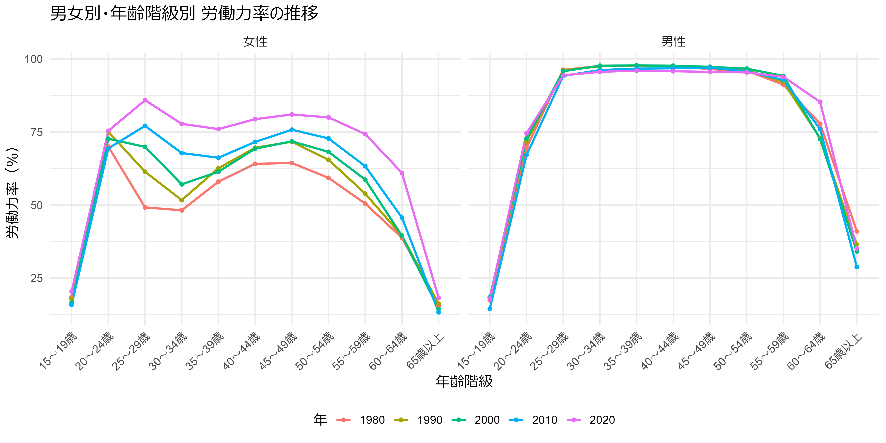
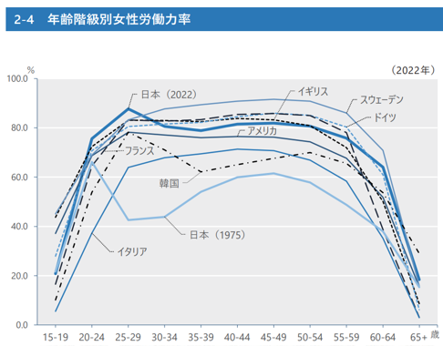
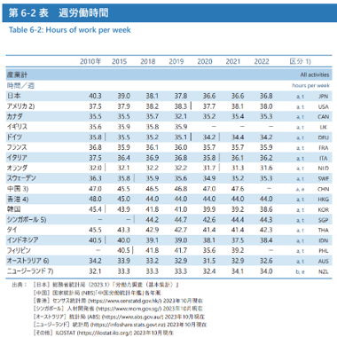
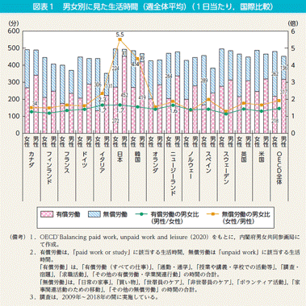
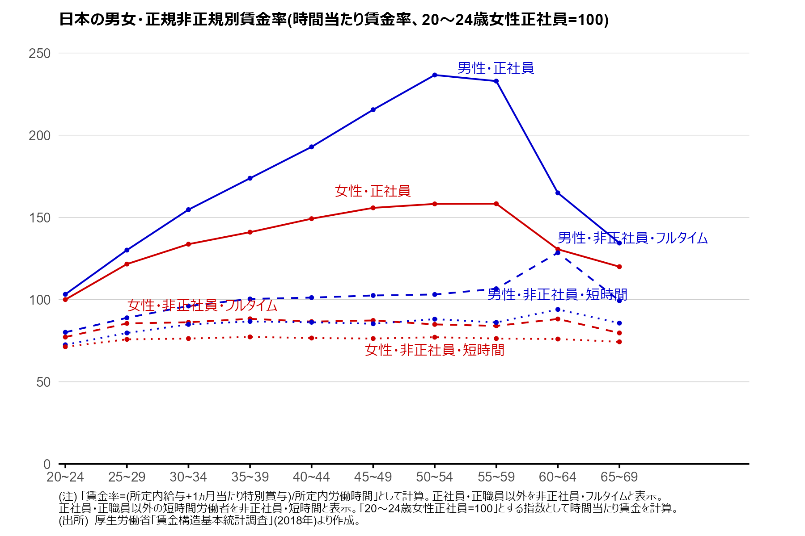
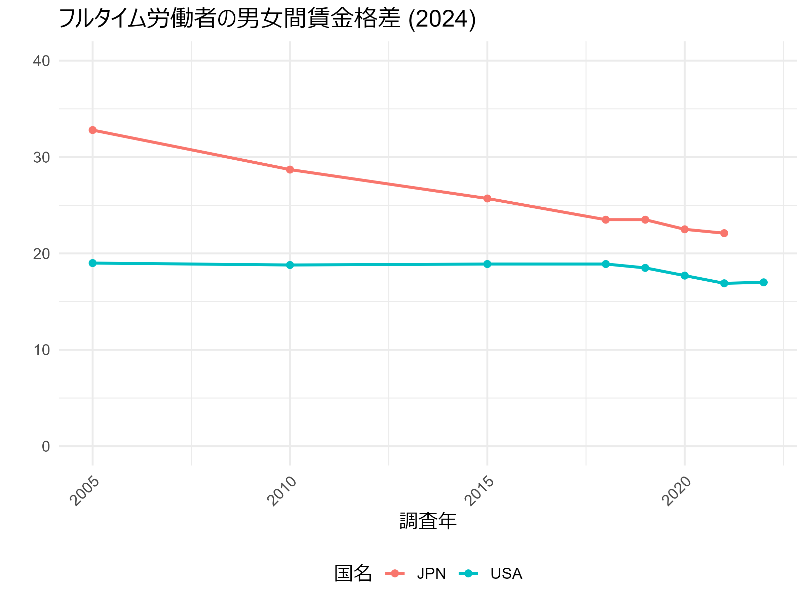

> 本資料は、大森義明・永瀬伸子（2021）『労働経済学をつかむ』有斐閣　を参考に作成しています。
> 授業目的に合わせて一部構成や表現を調整しています。

## 労働経済学とは？

労働経済学とは、労働者・雇用主・社会全体のつながりを経済学のモデルを使って読み解く分野です。私たちの生活に身近な問題を数多く扱います。

- 「労働需要と労働供給」「賃金決定メカニズム」「雇用形態の多様化」「人的資本投資の効果」といったトピックを扱う
  - 正社員と非正規社員という区分はなぜ存在するのか
  - 大学進学によって将来の収入はどれくらい変化するのか
  - 最低賃金の引き上げは雇用にどのような影響を与えるのか……

労働経済学は、こうした問いに理論と実証の両面から迫っていく学問です。

この授業では、労働経済学の基本的な考え方を身につけたうえで、日本の労働市場が持つ特徴を実際のデータから読み解いていきます。

## 日本の労働市場

まず、労働市場を読み解くうえで基本となる統計指標を確認します。これらを他国と比較することで、近年の日本の労働市場が持つ実態や特徴を捉えていきます。

ここで扱う指標は、単独ではなく組み合わせて見ることで、各国の労働市場の状況をより多面的に理解する手がかりになります。

## 労働市場の重要な指標

### 労働の構造を示す統計指標

#### 労働力率

::: {.callout-note appearance="default" icon="false"}
## 労働力率

**労働力率**：15歳以上の人口のうち、**労働力**に該当する人が占める割合

- **労働力**：現に仕事に就いている人（**就業者**）と、仕事はしていないが求職中ですぐに働ける人（**完全失業者**）を合計した人数
  - その国の経済規模や労働市場の動向を示す指標となる
  - 自営業や家族従業者、パート・アルバイト、フルタイム雇用者は、いずれも労働力に含まれる
:::

##### 年齢階級別労働力率

::: {.seminar-tip}
[図から分かること]{.seminar-tip-head}

* 日本の女性は、結婚・出産・育児の時期にあたる年代で労働力率が落ち込み、その後の年代で再び上昇するという**M字型カーブ**を描く。
  * 近年はこのくぼみが以前ほど深くなくなってきている。

* 他の多くの国では、M字型ではなく**高原型**と呼ばれる形状に近づいてきている。
  * 韓国は今もM字型の傾向が強い。
  * 女性の労働力率がもっとも高いのはスウェーデンである。
:::

労働力率のカーブがどのような形になるかは、各国の育児休業制度や、公的な補助を受けた保育施設の整備状況など、女性の就業を後押しする政策の有無に左右されます。

各国の育児支援制度（参考）

| 国名 | 制度 |
|------|------|
| スウェーデン | **育児休業制度**：両親それぞれに240日ずつ付与され、賃金の80％が補填される。 **子育て支援制度**：自治体は保育所への入所を希望する1歳以上の子どもに就学前保育の場を提供する義務を負う。16歳未満のすべての子どもに児童手当（所得制限なし）を支給。 **参考**：[スウェーデンにおける仕事と育児の両立支援施策の現状（JILPT, 2018）](https://www.jil.go.jp/foreign/labor_system/2018/12/sweden.html) |
| アメリカ | **育児休業制度**：連邦法では、従業員50人以上の企業に勤務する母親に対して、年間12週間の無給休暇の取得が認められている。有給休業制度については、居住する州や勤務先の企業によって導入状況に大きな差がある。 **子育て支援制度**：貧困家庭を対象とした扶養控除、児童税額控除などに留まる。 **参考**：[アメリカにおける仕事と育児の両立支援に関する諸政策（JILPT, 2018）](https://www.jil.go.jp/foreign/labor_system/2018/12/usa.html) |
| 日本 | **育児休業制度**：子が1歳に達するまで育児休業の権利を保障する。 **子育て支援制度**：年齢や所得に応じた給付金、児童手当などと支給。所得に応じた就学費用の援助や医療費助成制度などもある。 **参考**：[育児休業特設サイト（厚生労働省）](https://www.mhlw.go.jp/seisakunitsuite/bunya/koyou_roudou/koyoukintou/ryouritsu/ikuji/) [よくわかる「子ども・子育て支援新制度」（こども家庭庁）](https://www.cfa.go.jp/policies/kokoseido/sukusuku) |

:::{.quizbox}

**確認クイズ：**

なぜ日本の女性の労働力率はM字型になるのでしょうか？また、その形状は近年どう変化していますか？

<textarea class="quiz-answer" placeholder="ここに回答を入力..." oninput="localStorage.setItem('quiz1', this.value)"></textarea>

<button onclick="showAnswer('a1')">答えを見る</button>

解答例：結婚・出産・育児を理由に離職する女性が多いため。近年はそのくぼみが浅くなり、高原型に近づく傾向にある。

:::

#### 労働時間

労働時間は、週平均や1日あたりの平均という形で示されるのが一般的です。ここでは、週あたりの労働時間を国どうしで比べてみましょう。

::: {.seminar-tip}
[表から分かること]{.seminar-tip-head}

- 日本では、近年にかけて労働時間が徐々に短くなってきている。
- 総じてヨーロッパ諸国は労働時間が短く、アジア諸国は長めである傾向がみられる。
  - もっとも労働時間が長いのはシンガポール、もっとも短いのはオランダである
:::

続いて、男女別に週あたりの有償労働時間・無償労働時間がどのように分布しているかを見てみます。

::: {.callout-note appearance="default" icon="false"}
## 有償労働・無償労働

- **有償労働**：仕事全般に加え、通勤・通学や学校で過ごす時間まで含めた、労働・学業に関連する時間の合計
- **無償労働**：家事・育児・介護など、有償労働にあたらない労働時間すべての合計
:::

先ほどの週労働時間だけの表と比べると、数字の受け止め方が変わってくるかもしれません。

- いずれの国でも、有償労働時間は男性の方が長く、無償労働時間は女性の方が長い傾向にある。
  - 有償労働の男女差（女性を1とした男性の倍率）がもっとも大きいのは日本とイタリアの1.7倍、次いでニュージーランドの1.6倍。
  - 無償労働の男女差（男性を1とした女性の倍率）がもっとも大きいのは日本の5.5倍、次いで韓国の4.4倍、イタリアの2.3倍。
  - 有償・無償いずれの労働時間についても男女差がほとんどないのはフィンランドとスウェーデンで、比率はほぼ1に近い

このように、週労働時間の数字だけでなく無償労働の時間もあわせて見ることで、国ごとの違いがより浮かび上がってきます。

どの国でも女性の無償労働時間が長いのは、有償労働を切り詰めて家事や育児にあてる時間を確保しているためだと考えられます。

::: {.seminar-tip}
[役割分担型]{.seminar-tip-head}

**日本や韓国のケースでは、女性が労働時間を減らしたり離職したりする一方で、男性の労働時間が増えるという形で、家庭内の役割分担がなされている**様子がうかがえる。
:::

::: {.seminar-tip}
[共働き分担型]{.seminar-tip-head}

これに対して、フィンランドやスウェーデンのように**共働き世帯が多数を占める国**では、子どもが生まれたあとに**夫婦そろって労働時間を減らし、育児にあてる時間を増やす傾向**が見られる。育児と労働の負担を夫婦で分け合う形になっているといえる。
:::

:::{.quizbox}

**確認クイズ：**

日本や韓国など、無償労働の男女比が大きい国では、どのような家庭内の役割分担が行われていると考えられますか？

<textarea class="quiz-answer" placeholder="ここに回答を入力..." oninput="localStorage.setItem('quiz2', this.value)"></textarea>

<button onclick="showAnswer('a2')">答えを見る</button>

解答例：女性が労働時間を短縮したり仕事を辞めたりする一方で、男性が労働時間を伸ばすという形で、夫婦間で家事・育児と労働の役割が分担されている。

:::

#### 賃金率

::: {.callout-note appearance="default" icon="false"}
## 賃金率

**賃金率**：労働1単位時間あたりに支払われる給与（**労働所得**）。総給与を労働時間で割ることで求められる。

単位時間あたりにどれだけの**価値を生み出したかを近似的に表すもの**と考えられるため、生産性を測る指標のひとつとして解釈される。
:::

日本の場合、正規雇用者（正社員）は月給制であることが多く、その内訳は次の3つに分けられます。

:::{.seminar-steps}
1. **所定内給与**（決まって支給される給与）：基本給、職務手当、役職手当など
    - 企業によっては精勤・皆勤手当、通勤手当、家族手当等の手当てもあらかじめ労働契約によって決められていることも
2. **超過労働給与**：時間外勤務手当、深夜勤務手当、休日出勤手当、宿日当手当、交代勤務手当など
3. **賞与**：年2回程度支給されることが多い
:::

一方、パート・アルバイトは時給制・日給制であることが多いです。

##### 日本の男女・正規非正規別賃金率

::: {.seminar-tip}
[図から分かること]{.seminar-tip-head}

- 男性正社員の賃金率は、年齢が上がるにつれて大きく山型を描くように上昇し、その後下がっていく
    - 同じ正社員でも女性の場合、この山の高さは男性ほど大きくない
- 非正社員については、男女どちらも年齢による賃金率の変化がほとんど見られない
    - フルタイム勤務か短時間勤務かによる違いもさほど大きくない
:::

賃金率が生産性を映す指標だとすれば、正社員の男女間や、正社員と非正社員の間には大きな生産性の差があることになりますが、実際にそれほどの差が存在するのでしょうか。

仮に生産性の差があるとして、

- 受けてきた人材育成・訓練の差？
- 各自が望む働き方を選んだ結果としての差？
- 非正社員が持つ能力は、十分に発揮される機会を得られている？

実際のところ、日本における男女間・正規非正規間の賃金格差は、国際的に見ても大きい部類に入ります。一例として、アメリカとの比較でフルタイム労働者の男女賃金格差を見てみましょう。

※ここで、賃金格差は男女の中位所得の差を男性中位所得で除した数値のことを指します。

なぜこのような差が生まれるのでしょうか。

この点については、以降の章でも関連するテーマとして取り上げていきます。

:::{.quizbox}

**確認クイズ：**

非正社員と正社員、男女間で賃金率に大きな差が見られるのはなぜでしょうか？あなたの考えを自由に述べてください。

<textarea class="quiz-answer" placeholder="ここに回答を入力..." oninput="localStorage.setItem('quiz3', this.value)"></textarea>

<button onclick="showAnswer('a3')">答えを見る</button>

解答例： 
- 企業が正社員には訓練投資を行う一方で非正社員には行わないため、両者の間に生産性の差が生じている可能性がある。 
- 女性は結婚・出産を機に離職することが多く、そのため昇進や高賃金の機会を得にくく、結果として生産性・賃金の差につながっている可能性がある。

:::

### 日本の労働統計

日本の労働の実態を把握するため、政府はさまざまな統計調査を実施しています。それらの内容を整理したものが白書としてまとめられているので、一度目を通してみることをおすすめします。

- 『[労働経済白書](https://www.mhlw.go.jp/stf/wp/hakusyo/kousei/23/index.html)』（厚生労働省）
    - 賃金、労働時間、労働生産性、地域の雇用状況、人材マネジメントなど
- 『[働く女性の実情](https://www.mhlw.go.jp/content/11901000/001155643.pdf)』（厚生労働省）
- 『[男女共同参画白書](https://www.gender.go.jp/about_danjo/whitepaper/index.html)』（内閣府男女共同参画局）
    - 男女の労働参加、仕事と家庭の両立の状況、政治参加など

日本国内で実施される統計調査のうち、もっとも規模が大きいのが**国勢調査**です。5年ごとに、日本に住むすべての人を対象として、世帯の状況や就業状態、職業の種類などを調べています（参考：[令和2年国勢調査の概要](https://www.stat.go.jp/data/kokusei/2020/gaiyou.html)）。

全数調査であるため非常に詳細なデータが得られる一方、実施には多くのコストと時間を要するという難点もあります。

そのため、現状をより頻繁に把握する目的で、年1回や毎月といった短い周期で実施される標本調査も用いられています。

標本調査では、調査対象となる母集団をいくつかの層に分けたうえで、各層から適切な割合で無作為に抽出したサンプルをもとに調査が行われます。この方法により、コストと時間を抑えながらも、国全体を代表するデータを得ることができます。

以下で代表的な労働統計を紹介します。

::: {.seminar-tip}
[労働力調査]{.seminar-tip-head}

**毎月 / 総務省統計局 / 対象:世帯(約4万世帯・約10万人)**

各月末の1週間における就業状態を調査し、失業率の推計に用いられる。

失業者とは、月末1週間に仕事をしておらず、求職活動をしていて、すぐに就業可能な人を指す。
:::

::: {.seminar-tip}
[就業構造基本調査]{.seminar-tip-head}

**5年に1回 / 総務省統計局 / 対象:世帯(約52万世帯・約108万人)**

就業状態や労働時間、年収などを対象とした大規模な調査。

地域別・属性別により細かい分析を行うことができる。
:::

::: {.seminar-tip}
[賃金構造基本統計調査]{.seminar-tip-head}

**毎年 / 厚生労働省 / 対象:5人以上の常用雇用者のいる事業所(約6万5000事業所)**

企業の賃金台帳をもとにしているため、正確な給与・賞与のデータが得られる。

労働者の賃金構造を細かく把握することができる。
:::

ここまで見てきた世帯対象の調査と企業対象の調査には、それぞれ次のような特徴があります。

::: {.seminar-tip}
[世帯への調査]{.seminar-tip-head}

- **メリット**：小規模な事業所で働く人も含め、幅広い層の労働者を捉えることができる
- **デメリット**：賃金は「200万円台」「300万円台」といった階級値でしか把握できないことが多い
  - 例外：厚生労働省「国民生活基礎調査」、総務省統計局「全国消費実態調査」、厚生労働省「21世紀成年者縦断調査」など
:::

::: {.seminar-tip}
[企業への調査]{.seminar-tip-head}

- **メリット**：給与額や労働時間数を、より正確に把握することができる
- **デメリット**：失業者や無業者はもとより、小規模事業所で働く人や自営業者などは調査の対象に含まれない
:::

:::{.quizbox}

**確認クイズ：**

「正社員と非正社員の賃金の違いを、できるだけ正確な金額で把握したい」と思ったとき、どの統計調査を使えばよいでしょうか？また、その理由を説明してください。

<textarea class="quiz-answer" placeholder="ここに回答を入力..." oninput="localStorage.setItem('quiz4', this.value)"></textarea>

<button onclick="showAnswer('a4')">答えを見る</button>

解答例：企業側の記録に基づいた正確な給与データが得られる賃金構造基本統計調査を用いるのが適している。

:::

### 労働統計の利用

近年では、こうした統計の結果概要に誰でも簡単にアクセスできる環境が整ってきました。

日本の政府統計は過去のデータを含め、総務省が運営する政府統計の総合窓口（e-Stat）でまとめて確認することができます。

[e-Stat 政府統計の総合窓口](https://www.e-stat.go.jp/)

データはExcel形式で公開されているため、目的に応じて自分で表やグラフを作成したり、必要な数値を計算したりすることが可能です。

また、OECDのデータベースを使えば、各国の統計データの中から関心のある項目を選び、自分なりの集計表を作ることもできます。

[OECD Data Explorer](https://data-explorer.oecd.org/)

英語のサイトなので最初はとっつきにくく感じるかもしれませんが、操作自体は直感的にできるよう作られているので、ぜひ一度触ってみてください。

近年はChatGPTなどの生成AIが発達したことで、統計ソフトの扱いに関する敷居も下がってきました。すでに整理されたデータを見るだけでなく、自分自身で生データに触れてみることで、得られる情報量や理解の深さは格段に広がります。難しく考える必要はありません。まずは自分の興味のあるテーマから、実際にデータを確かめ、世の中を観察するきっかけにしてみてください。

### Tips

ここでは、統計調査に関して知っておくと役立つ知識を整理しておきます。

#### 調査分析の方法

調査は、その性質に応じていくつかの種類に分類することができます。

::: {.seminar-tip}
[横断面分析（クロスセクションデータ）]{.seminar-tip-head}

**複数の対象について、ある一時点のみで調査を行う**

**メリット**：地域による違いや性別・年齢層による違いを分析するのに用いる。

**デメリット**：ある一時点の情報にとどまるため、時間の経過に伴う変化は把握できない。
:::

::: {.seminar-tip}
[時系列分析]{.seminar-tip-head}

**同一の対象を複数の時点で継続的に調査する**

**メリット**：時間の経過に伴う傾向や変化を分析するのに用いる。

**デメリット**：同じ対象を継続して調査し続ける必要がある。
:::

::: {.seminar-tip}
[パネル分析]{.seminar-tip-head}

**複数の対象について、複数の時点にわたり繰り返し調査を行う**

**メリット**：地域や属性ごとの変化の追跡、同一個体内での変化の分析などに適している。

**デメリット**：時間の経過とともに特定の傾向を持つ対象が調査から抜け落ちやすく、母集団とのずれが生じる可能性がある。
:::

#### 統計における働き方の分類

{.seminar-fullwidth}

労働力調査や就業構造基本調査といった統計調査では、働き方はこの図のような形で分類されています。

このような分類が用いられるようになった背景には、次のような経緯があります。

:::{.seminar-steps}
1. **1980年代**：主婦層を中心にパートという働き方が広がる
2. **1990年代〜2000年代**：未婚者や高齢者、男性にもパート・アルバイトという働き方が浸透
3. **2000年代初頭**：規制緩和を経て派遣労働者や契約労働者が増加し、正規の職員・従業員とは異なる働き方として区別されるようになる
:::

日本では、雇用形態の呼び名によって賃金に大きな差が生じることが従来から指摘されてきました。

- 正社員とパートの間、あるいは短時間正社員とパートの間には大きな賃金格差がある
- 一方、パート雇用者の中で有期雇用者と無期雇用者を比べても、賃金格差はほとんど見られない
- これに対し海外の研究では、有期雇用か無期雇用かという違いこそが賃金を左右する重要な要因であるとする結果が多く報告されている

---

ここまで、男女別・年齢階級別の賃金率や労働力率、労働時間について、国際比較を交えながら日本の状況を見てきました。

その中でも、たとえば労働時間の男女比は国によってかなりばらつきがあることが分かりました。こうした国ごとの違いはどこから生まれるのでしょうか。文化や制度の違い、教育や保育の仕組み、企業の慣行、社会の価値観など、さまざまな要因が関わっていると考えられます。

この先の章では、労働者個人の行動（働くかどうか、何時間働くか）、企業側の労働需要、賃金と職務経験の関係、労働市場のミスマッチや失業が起こる仕組みなどを取り上げていきます。労働経済学の理論を学ぶことで、実社会で起きている現象への理解をより深めることができます。

皆さん自身も、これから働き方や雇用をめぐる大きな変化に直面する場面があるかもしれません。たとえばコロナ禍では、需要の急激な落ち込みによって多くの人が職を失う一方、テレワークや副業といった新しい働き方が広まりました。少子高齢化やAIの発展といった長期的な変化も、今後の労働市場に大きな影響を与えていくと考えられます。

労働経済学の理論は、こうした変化のただ中で「なぜこうなるのか」「これからどうなっていくのか」を考えるための道具になります。単なる知識として学ぶだけでなく、自分自身のキャリアや生き方を考えるためのヒントとしても、ぜひ活用してください。

:::{.quizbox}

**確認クイズ：**

次の文の空欄を埋めてください。

日本の女性の労働力率は、__<input type="text" class="fill-in" id="ikuji" placeholder="ここに入力">__ 期に低下し、その後再び上昇する、いわゆる「__<input type="text" class="fill-in" id="m" placeholder="ここに入力">__ カーブ」を描きます。

<button onclick="showAnswer('a5')">答えを見る</button>

育児・M字型

:::

[講義資料に戻る](index.html)


