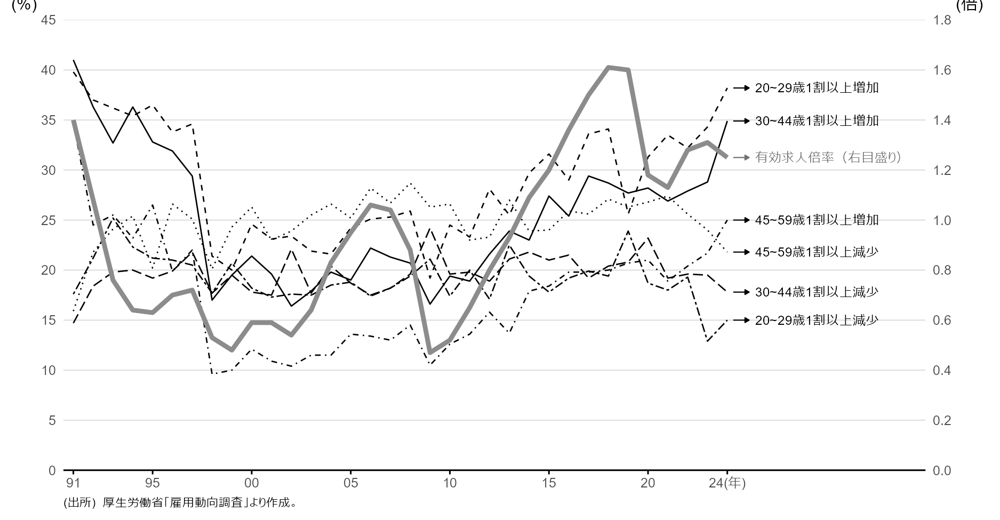
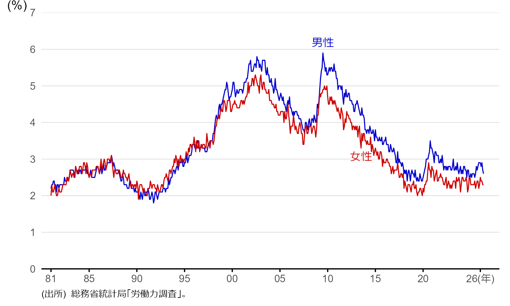

> 本資料は、大森義明・永瀬伸子（2021）『労働経済学をつかむ』（有斐閣）　を参考に作成しています。
> 授業目的に合わせて一部構成や表現を調整しています。

これまでの章では、労働者や企業がそれぞれどのように合理的な意思決定を行うかという**ミクロ経済学的な視点**から労働経済を扱ってきました。
本章では、そうした個々の意思決定が積み重なることで**労働市場全体**にどのような影響が生じるのかを、**マクロ経済学的な視点**から分析していきます。

# 転職・就職

## 転職の決定と職探し

### ジョブ・サーチの理論

**ジョブ・サーチ**とは職探しのことです。まずは大学生の就職活動を例に、職探しの過程でどのような基準に基づいて意思決定が行われるのかを見ていきましょう。


::: {.callout-tip appearance="default" icon="false"}
## 就職浪人をしようかどうか迷うタロウの例

大学4年生のタロウは、内定を得ている第2志望の会社に入社するか、それとも就職浪人をして第1志望の会社を目指すかで悩んでいます。

- 第1志望
  - 生涯賃金4億円
  - まだ内定なし
- 第2志望
  - 生涯賃金3億円
  - すでに内定あり

※生涯賃金以外の条件の魅力度は同じとする

タロウはすでに必要単位を取得済みで、卒論さえ提出すれば卒業できる状態です。

:::

ここでは、今年のうちに第2志望の会社に入社すべきか、あえて1年留年して来年もう一度第1志望を目指すべきかを考えてみます。

#### 追加的な1年間の就職活動の純便益

**就職活動の費用**

- 留年による1年分の学費100万円（※授業は履修しないため得るものはない）
- 就職活動にかかる直接費用10万円（交通費や通信費など）
- 第2志望の会社にそのまま入社していれば得られたはずの生涯賃金3億円（**機会費用**）

$\rightarrow$ 合計3億110万円

**就職活動の便益**

- （第1志望の会社に入れた場合）生涯賃金3億9000万円
  - 先に挙げた生涯賃金4億円は、今年入社して定年まで43年間勤めた場合の総所得
  - 留年すると勤続年数は42年になり、この会社の65歳時点の平均年収1000万円分を得られなくなる
- （就職活動がうまくいかなかった場合）生涯賃金8000万円（塾講師のアルバイトを想定）

$\rightarrow$ 純便益は内定確率によって変わる

**就職成功の場合** $\rightarrow$ **8890万円**（3億9000万円 $-$ 3億110万円）

**就職失敗の場合** $\rightarrow$ **-2億2110万円**（8000万円 $-$ 3億110万円）

では、内定確率がどの程度あれば就職活動を継続すべきでしょうか。求める確率を $P_{1}$ とすると、

$$
P_{1} \times 8890万円 - (1 -  P_{1}) \times 2億2110万円 = 0
$$

が成り立つ必要があります。整理すると、

$$
\begin{align}
(8890万円 + 2億2110万円) \times P_{1} - 2億2110万円  =& 0 \\
3億1000万円 \times P_{1} =& 2億2110万円 \\
P_{1} \approx& 0.713 \\
\end{align}
$$

内定確率が71.3%を超えている必要があります。

ただしこの考え方は、リスクを伴う第1志望の内定から得られる純便益の期待値と、確実に得られる第2志望の内定から得られる純便益の期待値を同等に扱える（**リスク中立的な態度**を持つ）人を前提としています。中には、内定確率が71.3%あってもリスクを取って留年することに不安を感じる（**リスク回避的な態度**を持つ）人もいるでしょう。そうしたリスク回避的な人が留年を選ぶには、リスクを伴う第1志望の内定から得られる純便益の期待値が、確実に得られる第2志望の内定の純便益の期待値を十分に上回っている必要があります。

::: {.callout-important appearance="default" icon="false"}
## まとめ：就職活動を続けるために必要な内定確率

- **就職活動の純便益** $=$ **就職活動の便益** $-$ **就職活動の費用**
- **就職活動の便益** $=$ 就職活動が成功した場合／失敗した場合それぞれの生涯賃金
- **就職活動の費用** $=$ 直接費用（学費・活動費）$+$ **機会費用**

就職成功時の純便益を $\pi_{S}$、失敗時の純便益を $\pi_{F}$ とすると、リスク中立的な人にとって就職活動を続けることが合理的になる内定確率 $P$ は、次の式を満たします。

$$
\begin{align}
P \pi_{S} + (1-P) \pi_{F} =& 0 
\end{align}
$$

:::

:::{.quizbox}

**確認クイズ：**  
大学に入学したばかりのあなたは、紹介された塾のアルバイト（月収10万円）に今月から入るか、それを辞退して、来月応募予定の有名テーマパークのアルバイト（月収20万円）に挑戦するか迷っています。アルバイト探しにかかる直接費用は無視できるものとします。雇用期間は、塾が3ヶ月、テーマパークが2ヶ月です。塾の内定を辞退した場合、今月の収入はありません。テーマパークのアルバイトに受からなければ、近所のカフェ（月収5万円）で働く予定です。次の問いに答えなさい。

1. テーマパークに内定したときの純便益はいくらか？ 

   <input type="text" class="fill-in" id="quiz1a" placeholder="ここに入力">万円

2. アルバイト探しに失敗したときの純便益はいくらか？  

   <input type="text" class="fill-in" id="quiz1b" placeholder="ここに入力">万円

3. アルバイト探し続けることが合理的となるために必要な内定確率はいくらか？

   <input type="text" class="fill-in" id="quiz1c" placeholder="ここに入力">

<button onclick="showAnswer('jobsearch')">答えを見る</button>
<div id="jobsearch" class="answer" style="display:none; margin-top: 0.5em;">
1. 10万円（$= 20万円 \times 2 - 10万円 \times 3$）<br>
2. -20万円（$= 5万円 \times 2 - 10万円 \times 3$）<br>
3. 約 0.67 （$P = 20/(10 + 20)$）
</div>

:::


ここからは、タロウを取り巻く条件が変わったときに、就職活動を続けることが合理的になる内定確率がどう変化するかを分析します。

##### Case 1：家業を継ぐことができるとき

就職活動が失敗に終わった場合、タロウには家業を継ぐという第3の選択肢があるとします。家業を継いだ場合の生涯賃金はおよそ2億円と分かっています。この条件は、就職活動に失敗したときの便益を変化させます。

このとき、就職活動を続けることの純便益は次のようになります。

**就職成功の場合** $\rightarrow$ **8890万円**（3億9000万円 $-$ 3億110万円）

**就職失敗の場合** $\rightarrow$ **-1億110万円**（2億円 $-$ 3億110万円）

したがって、就職活動を続けることが合理的になる内定確率は、次の式を満たします。

$$
\begin{align}
P_{2} \times 8890万円 - (1 - P_{2}) \times 1億110万円 & 0 \\
(8890万円 + 1億110万円) \times P_{2} - 1億110万円 =& 0 \\
1億9000万円 \times P_{2} =& 1億110万円 \\
P_{2} \approx& 0.532 \\
\end{align}
$$

内定確率が53.2%を超えている必要があります。

家業を継ぐという選択肢がなかった場合の必要内定率71.3%と比べると、かなり低い内定確率でも就職活動を続けることが合理的になっています。

ここで家業は、就職活動に失敗した場合の**セーフティネット**（安全網）として機能しています。この選択肢がなければ、最悪のケースでは生涯賃金がゼロになることすらあり得ますが、家業を継げるという逃げ道があるおかげでそうした事態を避けられているのです。

セーフティネットはタロウを助ける一方で、就職活動の期間を延ばしてしまうという副作用も持ち合わせています。

仮に家業を継ぐという選択肢がなければ、最悪の場合、生涯賃金はゼロになります。このとき、就職活動を続けることが合理的になる内定確率は、

$$
\begin{align}
P_{3} \times 8890万円 - (1 - P_{3}) \times 3億110万円 & 0 \\
(8890万円 + 3億110万円) \times P_{3} - 3億110万円 =& 0 \\
3億9000万円 \times P_{3} =& 3億110万円 \\
P_{3} \approx& 0.772 \\
\end{align}
$$

内定確率が77.2%を超えている必要があります。相当な自信がなければ、就職活動を続けることは合理的とは言えません。

家業を継ぐという選択肢がなければ、就職活動を切り上げて第2志望の会社に入社しようとするインセンティブが強まるのです。

多くの労働者にとっては、雇用保険の失業手当がこのセーフティネットの役割を担っています。

:::{.quizbox}

**確認クイズ：**  
就職活動を続けるか、第2志望の会社に就職するか迷っているハナコを考えます。  

- 第2志望に就職した場合の生涯賃金：**3億円**  
- 就職活動を続けて第1志望に**内定した場合**の生涯賃金：**4億円**  
- 就職活動に**失敗した場合**、家業を継ぐため生涯賃金は **2億円**  

就職活動を続けることが合理的になるために必要な**内定確率 \(P\)** を求めなさい。  

<input type="text" class="fill-in" id="quiz1c" placeholder="ここに入力"> 

また、家業を継ぐという選択肢がなかったときに、必要な内定確率はどう変化するか？

家業が継げるときより <input type="text" class="fill-in" id="high" placeholder="ここに入力"> なる。


<button onclick="showAnswer('safe')">答えを見る</button> 
<div id="safe" class="answer" style="display:none; margin-top: 0.5em;"> 

成功した場合の純便益：1億円

失敗した場合の純便益：-1億円

$$
P\times 1億 + (1-P) \times -1億 = 0
$$

より、$P = 0.5$

また、家業を継ぐという選択肢がなかったとき、必要な内定確率は**高く**なる。

</div> 

:::

##### Case 2：第2志望の会社の生涯賃金が高いとき

現在のオファー（生涯賃金）が高いほど、就職活動は短くなる傾向があります。もし、タロウが内定をもらった第2志望の会社の生涯賃金が3億円ではなく3億5000万円だったとしたらどうでしょうか。この違いは、就職活動を続けるときの機会費用を変化させます。

就職活動を続けることの純便益は次のようになります。

**就職成功の場合** $\rightarrow$ **3890万円**（3億9000万円 $-$ 3億5110万円）

**就職失敗の場合** $\rightarrow$ **-1億5110万円**（2億円 $-$ 3億5110万円）

したがって、就職活動を続けることが合理的になる内定確率は、次の式を満たします。

$$
\begin{align}
P_{4} \times 3890万円 - (1 - P_{4}) \times 1億5110万円 & 0 \\
(3890万円 + 1億5110万円) \times P_{4} - 1億5110万円 =& 0 \\
1億9000万円 \times P_{4} =& 1億5110万円 \\
P_{4} \approx& 0.795 \\
\end{align}
$$

内定確率が79.5%を超えていない限り、就職活動を続けることは非合理的になってしまいます。この水準は、Case 1で求めた53.2%よりもかなり高い数値です。

現在すでにある第2志望のオファーの生涯賃金が高くなるほど、就職活動を切り上げて第2志望の会社に入社しようとするインセンティブが強まるのです。

すでに働いている労働者が新たに職探しを始める場合には、現在の仕事の所得がこの「現在のオファー」にあたります。現在の所得が低ければ職探しのインセンティブが高まり離職しやすくなる一方、所得の高い仕事に就いている労働者ほど勤続年数は長くなり、所得が低い労働者ほど勤続年数は短くなる傾向があります。

:::{.quizbox}

**確認クイズ：**  
就職活動を続けるか、第2志望の会社に就職するか迷っているタロウを考えます。

- 就職活動を続けて**内定した場合**の生涯賃金：**4億円**  
- 就職活動に**失敗した場合**、家業を継ぐため生涯賃金は **2億円**  
- 第2志望の会社に就職した場合の生涯賃金：**$X$ 億円**

就職活動を続けることが合理的になるために必要な内定確率が  
ちょうど 50％（$P = 0.5$） になるような  第2志望の会社の生涯賃金 $X$ を求めなさい。

<input type="text" class="fill-in" id="half" placeholder="ここに入力"> 

<button onclick="showAnswer('highwage')">答えを見る</button> 
<div id="highwage" class="answer" style="display:none; margin-top: 0.5em;"> 

成功した場合の純便益：$(4-X)$億円

失敗した場合の純便益：$(2-X)$億円

$P=0.5$ より、
$$
\begin{align}
0.5(4-X)+0.5(2-X) &=0 \\
X &=3
\end{align}
$$

</div> 

:::

##### Case 3：第1志望の会社の生涯賃金が高いとき

Case 2とは反対に、第1志望の会社から期待できるオファー（生涯賃金）が高いほど、就職活動は長引く傾向があります。第1志望の会社の生涯賃金が3億9000万円ではなく4億5000万円だったとしたらどうでしょうか。この違いは、就職活動を続けるときの便益を変化させます。

就職活動を続けることの純便益は次のようになります。

**就職成功の場合** $\rightarrow$ **1億4890万円**（4億5000万円 $-$ 3億110万円）

**就職失敗の場合** $\rightarrow$ **-1億110万円**（2億円 $-$ 3億110万円）

したがって、就職活動を続けることが合理的になる内定確率は、次の式を満たします。

$$
\begin{align}
P_{5} \times 1億4890万円 - (1 - P_{5}) \times 1億110万円 & 0 \\
(1億4890万円 + 1億110万円) \times P_{5} - 1億110万円 =& 0 \\
2億5000万円 \times P_{5} =& 1億110万円 \\
P_{5} \approx& 0.404 \\
\end{align}
$$

内定確率が40.4%を超えていれば、就職活動を続けることは合理的になります。この水準は、生涯賃金が3億9000万円だった場合の53.2%より低く、期待できるオファーが高くなるほど、第2志望の内定を辞退して就職活動を続けようとするインセンティブが強まることが分かります。

:::{.quizbox}

**確認クイズ：**  
モモコは、**内定確率が40％を上回るなら就職活動を続けたい**と考えています。

条件は次の通りです。

- 第2志望の会社に就職した場合の生涯賃金：**3億円**  
- 就職活動に失敗した場合、家業を継ぐため生涯賃金は **2億円**  
- 第1志望の会社に内定した場合の生涯賃金：**$Y$ 億円**

このとき、就職活動を続けることが合理的になるためには、第1志望の会社の生涯賃金 $Y$ はいくら以上である必要がありますか。

<input type="text" class="fill-in" id="wage1" placeholder="ここに入力"> 

<button onclick="showAnswer('howwage')">答えを見る</button> 
<div id="howwage" class="answer" style="display:none; margin-top: 0.5em;"> 

成功した場合の純便益：$(Y-3)$億円

失敗した場合の純便益：$-1$億円

$P \geq 0.4$ より、
$$
\begin{align}
0.4(Y-3) + (1-0.4)\times (-1) &\geq 0 \\
Y & \geq 4.5
\end{align}
$$

</div> 

:::

以上のCase 1〜Case 3を踏まえ[^mamou]、ジョブ・サーチの理論から得られる示唆をまとめると次のようになります。

[^mamou]: 実際に自分の内定確率を見積もる際は、就職活動を1年延長することによる人的資本の摩耗や、汚名効果も考慮する必要があります。留年して1年間就職活動をしても、その間授業を受けるわけではないため、新しいスキルが身につかないどころか、すでに身につけた知識やスキルを失ってしまうことすらあり得ます。これを**人的資本の摩耗**と呼びます。また、留年した事実は応募先の企業にも伝わるため、「能力が足りず卒業できなかったのか」「内定を得られなかったのか」のいずれかだと受け取られかねません。こうした人的資本の摩耗や汚名効果によって、1年後の内定確率はむしろ下がってしまう可能性もあります。

::: {.callout-note appearance="default" icon="false"}
## ジョブ・サーチの理論

- **経験年数が長い労働者ほど賃金が高い**
  - 経験年数が長い労働者は長期間ジョブ・サーチを重ねてきたはずで、そのたびごとに最も条件の良いオファーを選んできたと考えられるため
- **勤続年数が長い労働者ほど賃金が高い**
  - 現在のオファーがすでに高水準だからこそ、それを上回るオファーがなかなか来ず、結果として同じ企業に長く勤めることになったと考えられるため
- **経験年数・勤続年数が長い労働者ほど離職・転職率が低い**
  - こうした労働者はすでに高い賃金を得ている傾向があるため

:::

::: {.quizbox}

**確認クイズ：**

次の文章を読み、空欄に入る最も適切な語句を選びなさい。

タロウが第1志望の企業への内定を目指して就職活動を続けるかどうかは、内定確率やその他の条件に左右される。たとえば、失敗したときに「家業を継ぐ」という選択肢があると、最悪でも一定の生涯賃金が得られる。このような選択肢は <input type="text" class="fill-in" id="safe" placeholder="ここに入力"> の役割を果たし、必要な内定確率を引き下げることになる。一方、第2志望の会社の生涯賃金が高まると、就職活動を続けることで失われる <input type="text" class="fill-in" id="cost" placeholder="ここに入力"> が大きくなり、活動を続けるにはより高い内定確率が必要になる。また、第1志望の会社の生涯賃金が高まると、得られる利益が大きくなるため、より <input type="text" class="fill-in" id="low" placeholder="ここに入力"> 内定確率でも活動を続けることが合理的になる。

<button onclick="showAnswer('search')">答えを見る</button>
<div id="search" class="answer" style="display:none; margin-top: 0.5em;">
セーフティネット・機会費用・低い
</div>

:::

ここまでは新卒としての就職活動を分析してきましたが、一度就職した後にも中途採用を通じて転職するケースはよくあります。現職に就いたまま行う就職活動のことを**オン・ザ・ジョブ・サーチ**と呼びます。

::: {.callout-note appearance="default" icon="false"}
## オン・ザ・ジョブ・サーチ

- 現職で働きながら並行して行う就職活動のこと
- 転職しない場合と比べて、**転職した方が生涯所得が大きくなると見込まれるときに転職**が選ばれる
  - ただし生涯所得と賃金は同じではないため、転職によって必ずしも賃金自体が上がるとは限らない
  - 実際には、求職者は生涯賃金だけでなく、労働時間、フレックスタイム制の有無、仕事内容、通勤時間、出産・育児休暇、事業所内保育施設、訓練機会、将来の転職可能性など、さまざまな要素を踏まえて仕事全体の長期的な効用を比較し、転職の意思決定を行っていると考えられる

:::

転職によって必ずしも賃金が上がらないケースとしては、たとえば次のようなものが挙げられます。

- 現職の企業の業績悪化が見込まれ、今後賃金が下がりそうなため、下がる前に転職する
- 現時点では現職の賃金の方が高いものの、今後の伸びは小さいと見込まれる一方、転職先は現時点の賃金は低くても長く勤めることで大きな上昇が期待できる


### ジョブ・マッチングの理論

これまでの議論では、ある人にとっての「良い」仕事が、他の誰にとっても「良い」仕事であることを暗黙のうちに前提としていました。

しかし実際には仕事にもさまざまなタイプがあり、何を魅力に感じ、何をもって「良い」仕事とするかは人によって異なります。

たとえば、挑戦の多い仕事に惹かれる人とそうでない人、実力主義の環境を好む人とそうでない人がいます。あるいは、ものづくりに向いている人とそうでない人、人とのコミュニケーションが得意な人とそうでない人もいます。

こうした、仕事と労働者の組み合わせ（マッチ）の質が人によって異なる状況でのジョブ・サーチを扱うのが**ジョブ・マッチング理論**です。

::: {.callout-note appearance="default" icon="false"}
## ジョブ・マッチングの理論

- 仕事と労働者のマッチの質が賃金に反映されると考える理論
  - ただし、**マッチの質は就職する前には分からず**、実際に働きながら生産性を観察していく中で徐々に明らかになっていく
- **マッチの質が高い場合**、労働者の生産性は高くなり、企業は離職を防ぐために高い賃金を支払う
- **マッチの質が低い場合**、労働者の生産性は上がりにくく、転職や離職を通じてそのマッチングは淘汰されていく

この理論から導かれる帰結

- **若い（勤続年数が短い）労働者ほど転職しやすい**
- **勤続年数が長い労働者ほど賃金が高い**
- **転職を通じてマッチの質が改善され、それに伴って賃金が上昇する**

:::

労働者は、自分の特性を生かせる質の高いマッチが実現すれば高い生産性を発揮でき、高い賃金も得られます。一方、ミスマッチな仕事に就いてしまうと、生産性は低く評価され、賃金も伸び悩み、結果として離職や転職を選ぶ可能性が高まります。

ここでの「ミスマッチ」は、メディアなどでよく耳にする仕事と労働者のミスマッチとは意味合いが異なる点に注意が必要です。

- 一般的に語られるミスマッチ：介護業界で労働需要が労働供給を上回る一方、他の産業では逆に供給が過剰になっているといった、各労働市場における需給のギャップ
- ジョブ・マッチング理論でのミスマッチ：個々の労働者と個々の仕事の組み合わせの質が低いこと（労働市場全体の需給が均衡していても起こり得る）

ジョブ・マッチング理論が想定するミスマッチの実証的な証拠を見つけるのは、非常に難しい作業です。

一方で、大森義明・永瀬伸子（2021）『労働経済学をつかむ』（有斐閣）は、学歴や専攻分野のミスマッチがない労働者に絞って比較しても、日本のミスマッチの割合は国際的に見て高いことを指摘しています。

長期雇用を前提とする日本の雇用慣行が、多様な個人と多様な仕事とを柔軟にマッチングさせるうえでの制約になっている可能性も考えられます。

::: {.quizbox}

**確認クイズ：**

次の文章を読み、空欄に入る最も適切な語句を選びなさい。

現職で働きながら行う就職活動のことを <input type="text" class="fill-in" id="ojs" placeholder="ここに入力"> と呼ぶ。一般に、転職をしない場合と比較して、転職する場合の <input type="text" class="fill-in" id="income" placeholder="ここに入力"> が大きいと見込まれるときに転職が行われる。 また、ジョブ・マッチング理論では、仕事と労働者のマッチの質は就職前には分からず、働きながら <input type="text" class="fill-in" id="productivity" placeholder="ここに入力"> を観察することで徐々に明らかになるとされる。この理論の帰結として、マッチの質が未確定な <input type="text" class="fill-in" id="young" placeholder="ここに入力"> （勤続年数が短い）労働者ほど、より良いマッチを求めて転職しやすい傾向がある。

<button onclick="showAnswer('job_matching')">答えを見る</button>

<div id="job_matching" class="answer" style="display:none; margin-top: 0.5em;">
オン・ザ・ジョブ・サーチ・生涯所得・生産性・若い
</div>
:::

## 労働市場の流動性

ここでは、アメリカと日本の労働市場を比較しながら、日本における転職の実態を分析していきます。

前提として、アメリカの労働市場は日本と比べてかなり流動性が高いことが知られています。

::: {.callout-note appearance="default" icon="false"}
## 男女間の転職行動の差

**日本**[^shucho]

- **男性**：30代～50代の約5割は初職に就いた企業で働き続けており、約7割は転職回数が1回以下
- **女性**：40代の初職継続者は3割以下
- **背景要因**：育児・介護などケアに対する家族のニーズが、女性の離職を促しやすいと考えられる

**アメリカ**

- **男性・女性共通**：初職を長期間継続する雇用慣行は弱く、現職勤続年数の中央値は  
  男性4.2年、女性3.6年と短い[^usstat]
- **性差**：勤続年数は男性の方がやや長いが、日本のように女性の初職継続率が著しく低いという形では観察されない[^usstat]
- **背景要因**：介護開始や家族ケアは、女性の就業継続や賃金に負の影響を与えやすいことが、行政データを用いた実証研究で示されている[^goldin]

**共通点と差異**

- **共通点**：家族ケアが女性の就業継続に不利に働きやすい点は日米で共通
- **差異**：日本では初職からの長期継続を前提とした男女差が大きい一方、アメリカでは全体として勤続が短く、男女差は相対的に小さい

:::

[^shucho]: 『労働経済白書』2014年。「就業構造基本調査」より算出
[^usstat]: Bureau of Labor Statistics, *Employee Tenure Summary*, 2024
[^goldin]: （例）Goldin, Claudia. "A grand gender convergence: Its last chapter." *American economic review* 104.4 (2014): 1091-1119.

::: {.callout-note appearance="default" icon="false"}
## 年齢間の転職行動の差

**日本**

- **若年層**：比較的転職確率が高い。転職後の企業で長く働き続けることができること、仕事とのミスマッチを解消することができることのメリットが大きいと考えられる
- **高齢層**：定年退職、健康状態の変化により初職継続率が大幅減。年金もあるため無職者が増える

**アメリカ**[^sensus]

- **若年層**：雇用主変更（job-to-job transition）が最も多い。キャリア初期のミスマッチ解消や賃金成長の機会が大きい
  - 典型的なアメリカの男性はキャリアの最初の10年で7つの雇い主のもとで働く[^topel]
- **高齢層**：雇用主変更は大きく低下し、仕事から非就業への移行が増加。年金受給とともに労働市場から退出する割合が高まる

**共通点と差異**

- **共通点**：若年ほど転職が多く、高齢ほど労働市場から退出しやすい
- **差異**：日本では定年制度が行動を強く規定するのに対し、アメリカでは制度よりも健康状態や資産状況に基づく段階的退出が多い

:::

[^sensus]: US Census Bureau *Job-to-Job Flows*；Fallick and Fleischman 2004
[^topel]: Topel, Robert H., and Michael P. Ward. "Job mobility and the careers of young men." *The Quarterly Journal of Economics* 107, no. 2 (1992): 439-479.


::: {.callout-note appearance="default" icon="false"}
## 転職による賃金上昇の役割

**日本**

- 転職による賃金上昇の役割は限定的[^koyo]であり、**有効求人倍率**との相関がみられる

**アメリカ**

- 雇用主間移動は、賃金上昇の重要な要因の一つであり、特に景気拡張期には、転職者の賃金上昇率が高い[^topel]
- 自発的離職率（quits rate）は景気循環に強く連動し、良好な労働市場では転職を通じた賃金上昇が起こりやすい[^usstat]

**共通点と差異**

- **共通点**：転職の便益は、労働需給が逼迫している局面ほど大きい
- **差異**：日本では同じ企業で働き続ける中で賃金が上がりやすく、転職による賃金上昇は限定的であるのに対し、アメリカでは転職が賃金を高める有力な方法になりやすい。

:::

[^koyo]: 厚生労働省「雇用動向」1991～2018年

::: {.callout-note appearance="default" icon="false"}
## 有効求人倍率

公共職業安定所（ハローワーク）のデータに基づき、**有効求人数 $\div$ 有効求職者数**で算出される指標で、1人の求職者に対し何件の求人があるかを示す。

- 1を超える：有効求人数 $>$ 有効求職者数 であり、**労働需要超過**の状態
- 1を下回る：有効求人数 $<$ 有効求職者数 であり、**労働供給超過**の状態

:::

日本では、転職の前後で賃金がどう変化するかが有効求人倍率と関係しています。



- 求人が多い時期（有効求人倍率が高い） $\rightarrow$ 賃金水準が上昇 $\rightarrow$ 賃金が上がる転職が増える
- 求人が少ない時期（有効求人倍率が低い） $\rightarrow$ 経営不振などやむを得ない事情での転職が増える $\rightarrow$ 賃金が下がる転職が増える

::: {.quizbox}

**確認クイズ：**

次の文の空欄に当てはまる最も適切な言葉を答えなさい。

<input type="text" class="fill-in" id="sukunai" placeholder="ここに国名を入力"> では、転職による賃金上昇の役割は比較的限定的である一方で、 <input type="text" class="fill-in" id="main" placeholder="ここに国名を入力"> では、転職（雇用主間移動）が賃金上昇の重要な要因になりやすい。  

このような違いは、アメリカの労働市場の <input type="text" class="fill-in" id="ryoko" placeholder="ここに入力"> が日本よりも高いことと関係している。

<button onclick="showAnswer('ryudo')">答えを見る</button>

<div id="ryudo" class="answer" style="display:none; margin-top: 0.5em;">
日本、アメリカ、流動性
</div>
:::

### 労働市場の流動化と解雇規制

長期にわたるデフレによる就職難や、経済的困窮からの再チャレンジを後押しする狙いから、2006年に経済財政諮問会議で「労働ビッグバン」と呼ばれる労働市場改革が提唱されました。

- 生産性の低い分野から高い分野へ労働者がスムーズに移動できる仕組み
- 勤務時間を多様化し、育児や介護を担う労働者が働きやすくなる仕組み
- 年功ではなく職種に応じて処遇が決まる仕組み

こうした**労働市場の流動化**を実現する仕組みづくりが目指されました。[^big]

[^big]: ただし、「解雇の金銭補償ルール」のように正社員の流動性を高める政策については、今なお議論が続いています。

転職は、**労働資源の再配分**という重要な役割を担っています。

- 国際競争、技術革新、人口動態の変化などにより各産業・職種の労働需要は変化し、需要の高まった領域ほど労働者の価値も高まる
  - より業績の良い企業への転職
  - 輸入産業から輸出産業への転職
  - 技術革新によって生まれた新しい産業・職種への転職
  - より好況な地域への転職
- こうした転職の積み重ねによって、限られた労働資源が社会にとって望ましい形へと再配分されていく
- **解雇規制**は転職率、ひいては労働資源の再配分のあり方にも大きく影響する
  - 解雇規制が厳しい場合：解雇が起こりにくく、それに伴う転職も減る
  - 解雇規制が緩い場合：解雇が容易になり、それに伴う転職も増え、労働資源の再配分がより速く進む

::: {.quizbox}

**確認クイズ：**

以下は、労働市場に関する政策や制度の特徴です。  
それぞれについて、最も直接的に生じやすい結果として**正しいもの**を  
A〜Dから1つずつ選びなさい。

**政策・制度**

1. 解雇規制が厳しい <input type="text" class="fill-in" id="b" placeholder="ここに入力"> 
2. 労働市場の流動性が高い <input type="text" class="fill-in" id="a" placeholder="ここに入力"> 
3. 有効求人倍率が高い局面 <input type="text" class="fill-in" id="v" placeholder="ここに入力"> 
4. 同一企業内での長期雇用が中心 <input type="text" class="fill-in" id="b" placeholder="ここに入力"> 

**結果**

A. 転職を通じた賃金上昇が起こりやすい  

B. 労働資源の再分配が進みにくい

C. 賃金が下がる転職が増えやすい  

D. 勤続を通じた賃金上昇が中心になる  

<button onclick="showAnswer('ad')">答えを見る</button>

<div id="ad" class="answer" style="display:none; margin-top: 0.5em;">
B A A D
</div>
:::

# 賃金格差

アルバイトや就職活動を通じて、私たちは普段から「時給」や「初任給」の違いを目にしています。では、日本全体で見たとき、こうした格差はどの程度あり、どのような要因から生まれているのでしょうか。

まずは、現在観察できる事実を確認するところから始めましょう。

::: {.callout-note appearance="default" icon="false"}
## 職種間の賃金格差

職種によって平均賃金には大きな開きがあります。厚生労働省「賃金構造基本統計調査（令和6年）」のデータによると、職種別の所定内給与額の平均はおよそ次のとおりです。

- 管理的職業：約57万円
- 技術者：約37万円
- 医師：約91万円
- 看護師：約33万円
- 学校教員：約43万円
- 事務職：約32万円
- 販売職：約33万円
- サービス職：約26万円

このように、職務内容や求められる技能が異なる職種間では、平均賃金にはっきりとした差が見られます。

:::

::: {.callout-note appearance="default" icon="false"}
## 男女間の賃金格差

男女間の賃金格差は、日本の労働市場が抱える大きな課題の一つです。

- **G7（主要7カ国）中最下位クラス**：OECD（経済協力開発機構）のデータによれば、日本の男女間賃金格差は加盟国の中でも大きく、G7内でも依然として最下位レベルにあります。
- **およそ7割の水準**：男性一般労働者の給与水準を100としたとき、女性一般労働者の給与水準はおおよそ70〜75程度で推移しています（所定内給与額ベース）。

この格差は単に「同じ仕事をしていても男女で賃金が異なる」ことだけを意味するものではなく、職種・勤続年数・労働時間・役職・雇用形態などの違いが複合的に絡み合っている可能性があります。

:::


### 賃金格差を生じさせる要因

このように、賃金格差はさまざまな角度から観察できます。では、こうした格差を生む要因とは何でしょうか。

::: {.callout-note appearance="default" icon="false"}
## 格差の「要因」

**他の条件が同じであるとき**に、賃金に対して**因果的な影響を及ぼす原因**のこと。

**観察できる要因**

- 需要・供給要因
- 人的資本（教育、学歴、訓練）
- ジョブ・サーチ
- 後払い賃金制度
- 補償賃金（職場環境、付加給付）

**観察できない要因**

- 意欲・やる気
- 能力
- 差別
  - 偏見・嗜好による差別
  - 統計的差別
  - アンコンシャス・バイアス（無意識の差別）

:::

賃金格差は、さまざまなグループの間で観察されます。

学歴間、経験年数・勤続年数間、職種間、企業規模間、産業間、雇用形態間、男女間などです。

ただし、たとえば職種間で賃金格差が見られたとしても、「職種」そのものが格差の要因というわけではありません。職種という区分自体が賃金に因果的な影響を与えるわけではなく、職種間で賃金格差が生じるのは、その職種に対する需要と供給のバランス、必要とされる人的資本の水準、職場環境といった賃金格差の要因が職種ごとに異なることが主な理由だと考えられています。

::: {.quizbox}

**確認クイズ：**

次のA〜Eは、日本で観察される賃金格差に関する記述です。  
このうち、**賃金格差の「要因」ではなく、単なる「観察された違い」**に該当するものを  
すべて選びなさい。

A 管理的職業の平均賃金は、サービス職より高い  

B 教育・学歴の違いは、賃金に因果的な影響を与える可能性がある

C 男女間で平均賃金に差があり、女性は男性の約7割の水準である

D 職種によって、必要とされる技能や人的資本が異なる  

E 意欲や能力の違いが賃金に影響している可能性がある  

<input type="text" class="fill-in" id="youin" placeholder="該当する記号をすべて入力"> 

<button onclick="showAnswer('kakusa')">答えを見る</button>

<div id="kakusa" class="answer" style="display:none; margin-top: 0.5em;">

A, C

- A・Cは、データから**観察されている賃金の差**を述べたものであり、それ自体は賃金に因果的な影響を与える「要因」ではありません。  
- B・D・Eは、**他の条件が一定であるときに賃金へ影響を与えうる要因**です。  

</div>
:::

#### 賃金格差をもたらす測定可能な要因に関する経済理論

ここではまず、測定可能な要因から見ていきます。

:::{.seminar-steps}
1. **需要・供給要因**
   - 労働市場のモデルによれば、労働需要が増えれば賃金は上がり、労働供給が増えれば賃金は下がる
     - ある仕事への需要が高まれば、その仕事の賃金は上昇する
     - ある世代の労働者数が多ければ、その世代の賃金は他の世代と比べて低くなりやすい
     - **産業間・職種間・世代間の格差**として表れる
   - 賃金格差が存在することで、需要の低い産業から高い産業へと労働者が移動していき（この動きは格差が解消されるまで続く）、賃金格差は労働サービスという希少な資源を効率的に配分する機能を果たしているといえる

2. **教育・学歴**
   - 教育や学歴は、生産性の高い仕事に就く可能性を高める
   - 企業は、より高い成果を期待できる（人的資本をより多く蓄積した）労働者に高い賃金を支払う傾向がある
   - **学歴・教育年数間の格差**として表れる

3. **訓練**
   - 企業内訓練や職業訓練を通じて技能を身につけた労働者は、生産性が高まる
   - 訓練機会が多い職種・働き方ほど、賃金が高くなりやすい
   - **雇用形態間、経験年数・勤続年数間の格差**として表れる

4. **ジョブ・サーチ**
   - 転職や就職の際、より良い条件の仕事を見つけるには時間と情報が必要になる
   - ジョブ・サーチには収入の不安定さや時間・労力といったコストが伴う
     - 早急に収入を得る必要がある、転職回数の多さが評価を下げやすい、得られる情報が限られている、といった労働者は、条件の良くない仕事でも受け入れざるを得ない
     - 収入がなくても生活に余裕がある、転職が不利に働きにくい、情報収集や交渉が得意、といった労働者は、時間をかけて良い条件の仕事を探すことができる
   - **能力（生産性）とは無関係に生じる格差**として表れる

5. **後払い賃金制度**
   - 従業員の定着や努力を引き出すため、若年期には生産性より低い賃金を、中高年期には生産性より高い賃金を支払う
   - **勤続年数間・年齢間の賃金格差**として表れる

6. **補償賃金**
   - 敬遠されやすい仕事に人を集めるために、他の仕事より高い賃金を支払うことで生じる格差（**補償賃金格差**）
     - 3K（きつい、危険、汚い）、責任の重さ、雇用の不安定さなど
   - **職種間の賃金格差**として表れる
:::


#### 賃金格差に関する測定不可能な要因

ここまでで、賃金が資源配分（労働サービスの配分）を効率的に行ううえで重要な指標であることが分かりました。一方で、学歴や経験のように測定できる要因だけでは説明のつかない賃金格差も存在します。

1. **偏見・嗜好による差別**
   - **雇用主・労働者・顧客**それぞれの偏見や嗜好によって生じる
     - 古典的には Becker (1957)[^becker] による、偏見・嗜好に基づく人種差別が賃金格差をもたらすという理論がある
     - 生産性に関わる観測可能な要因が同じ労働者を、性別、年齢、出身地、人種、信仰、外見、性的指向などによって異なる扱いをするのは、本来は非合理的である
   - 雇用主による差別：（例）女性より男性を好む場合
     - 女性の賃金が男性よりも十分に低くない限り女性を雇わない
     - 雇用主は女性を雇うことに一種の心理的費用を感じていると解釈できる
   - 労働者による差別：（例）特定のグループの労働者と一緒に働くことを嫌う場合
     - 雇用主にとってはどちらか一方のグループのみを雇う方が最適になる
     - グループごとに分かれた職場は生まれるが、グループ間の賃金格差自体は生じない
   - 顧客による差別：（例）女性労働者による対応を嫌う場合
     - 雇用主は女性の賃金が男性よりも十分に低くない限り女性を雇わない

[^becker]: Becker, Gary Stanley. The economics of discrimination: an economic view of racial discrimination. University of Chicago, 1957.

2. **統計的差別**
  - 労働者個人の属性について企業と労働者の間に情報の非対称性があり、個々の属性を見極めるコストが高い場合に、企業が労働者の属するグループの平均的な特徴をもとにその個人を判断してしまうこと
  - （例）企業は長く勤めてくれる労働者を雇いたいが、長期勤続の意思がある人とない人を個別に見分けるのは難しい
    - 女性全体の平均離職率が男性全体より高い

    $\rightarrow$ 女性の採用を控えたり、女性に企業特殊訓練を実施しなかったりする
  - （例）企業が労働者個人の能力を見極めるのが難しい場合
    - 偏差値の高い大学の卒業生の方が能力が高いだろうと予測する

    $\rightarrow$ 偏差値の低い大学の卒業生を採用対象から外す
  - **個々の労働者の属性を判断するコストが低いのであれば、こうした統計的差別は企業にとっても非合理的な行動になる**

3. **アンコンシャス・バイアス**
  - 本人が意識しないまま差別的な行動をとってしまうこと
    - 心理学の知見を取り入れた概念
    - 時間をかければ公正な判断ができても、仕事に追われて短時間で判断を下さざるを得ないときには、意識的な判断とは異なる脳の領域が働き、無意識のうちに判断してしまうことがある
      - その結果、本人が抱く暗黙の価値観の影響を受け、無自覚な差別が生じる
  - （例）育児休業から復帰した女性に対し、本人に相談することなく、上司が無意識のうちに以前より簡単な仕事を割り振ってしまう
    - 「母親は育児に専念すべきだ」という無意識の思い込みが背景にある

:::{.quizbox}

**確認クイズ**

次の１〜６は、賃金格差が生じている具体的な状況です。  
それぞれについて、**最も適切な理論を1つだけ**下の選択肢から選びなさい。

1. ある産業で人手不足が深刻化し、他産業より賃金が高くなった結果、労働者がその産業へ移動している。　<input type="text" class="fill-in" id="cdes" placeholder="ここに入力"> 

2. 大学進学により高度な知識を身につけた人ほど、高い賃金の仕事に就いている。　<input type="text" class="fill-in" id="fdes" placeholder="ここに入力"> 

3. 企業内で長く働くほど賃金が上昇し、若年期は生産性より低い賃金が支払われている。
<input type="text" class="fill-in" id="edes" placeholder="ここに入力"> 

4. 収入の余裕や情報が乏しい人ほど、条件の悪い仕事でも早く受け入れている。　<input type="text" class="fill-in" id="ddes" placeholder="ここに入力"> 

5. 危険で敬遠されやすい仕事ほど、他の仕事より賃金が高く設定されている。　<input type="text" class="fill-in" id="ades" placeholder="ここに入力"> 

6. 能力や経験が同じでも、性別や出身といった属性によって賃金や採用が不利になる。　<input type="text" class="fill-in" id="bdes" placeholder="ここに入力"> 

**選択肢**

A 補償賃金  
B 差別（偏見・統計的差別・アンコンシャス・バイアス）  
C 需要・供給要因  
D ジョブ・サーチ  
E 後払い賃金制度  
F 教育・学歴  

<button onclick="showAnswer('difcase')">答えを見る</button> 
<div id="difcase" class="answer" style="display:none; margin-top: 0.5em;"> 

**答え**

1. C
2. F
3. E
4. D
5. A
6. B 

</div> 

:::

### 差別による賃金格差を縮小するための法律

このように、差別はさまざまな背景から生じますが、労働者の生活を守るため、差別を解消するための政策的な取り組みも進められています。

1. **男女雇用機会均等法**
  - 1985年に成立し、それまで行われていた男女別の採用を禁止した法律
  - 妻子を養う男性を想定した（昇進の可能性が高くコミットメントの強い）働き方 $\rightarrow$ 総合職
  - もともと未婚女性を想定していた働き方 $\rightarrow$ 一般職
  - 大半の男性が総合職に、女性が一般職に就くという構図は、2000年代になっても大きくは変わらなかった
    - 2000年代以降は、特に女性の非正社員雇用（不安定・低賃金）が拡大した

2. **同一労働同一賃金**
  - 同じ労働をしているなら同じ賃金を支払うべきだという基本原則
  - 2018年の「働き方改革法案」によって導入された
  - 何をもって「同一労働」とするかの定義については、厚生労働省は司法判断に委ねる形をとった

3. **ポジティブ・アクション**（**アファーマティブ・アクション**）
  - 平等な機会を得られなかった少数集団に対し、その是正を目的とした積極的な取り組みを行うこと
  - 厚生労働省の定義：「固定的な男女の役割分担意識や過去の経緯から、管理職に女性がほとんどいない、課長以上の管理職の大半を男性が占めているといった男女間の差が生じている場合に、これを解消しようと個々の企業が行う自主的かつ積極的な取り組み」
    - 国によっては、特定の集団に対して一定の雇用割当を義務づけている場合もある

::: {.quizbox}

**確認クイズ：**

次の文章を読み、空欄に最も適切な語句を入れなさい。

他の条件を一定として、若い女性労働者の提供サービスと比べ高齢の男性労働者の提供するサービスを顧客が嫌う場合は、 <input type="text" class="fill-in" id="kokyaku" placeholder="ここに入力"> が、財やサービスを購入する際に、価格のみならず、高齢の男性労働者によて提供されたサービスを消費する <input type="text" class="fill-in" id="cost" placeholder="ここに入力"> を支払っていると考えると理解しやすい。高齢の男性の賃金が若い女性と比べ十分 <input type="text" class="fill-in" id="low" placeholder="ここに入力"> なければ、雇用主は <input type="text" class="fill-in" id="men" placeholder="ここに入力"> を雇わない。従って、雇用主が <input type="text" class="fill-in" id="nodes" placeholder="ここに入力"> であっても、顧客が <input type="text" class="fill-in" id="des" placeholder="ここに入力"> であるならば、若い女性よりも <input type="text" class="fill-in" id="hikui" placeholder="ここに入力"> 賃金で高齢の男性を雇えることになる。

人は自身が差別をしていることを認識しないまま差別的な行動をとり、これが採用差別や、昇進差別を引き起こす可能性がある。こうした差別は、意識的な差別でないだけに <input type="text" class="fill-in" id="un" placeholder="ここに入力"> と呼ばれる。

---

語句

低い、低く、高い、高く、機会費用、心理的費用、差別的、非差別的、高齢の男性、若い女性、顧客、雇用主、アンコンシャス・バイアス

<button onclick="showAnswer('descrimination')">答えを見る</button>

<div id="descrimination" class="answer" style="display:none; margin-top: 0.5em;">
顧客、心理的費用、低く、高齢の男性、非差別的、低い、アンコンシャス・バイアス
</div>
:::


## グループ間の賃金格差

ここまで、賃金格差を生む要因を測定可能なもの・不可能なものの両方から見てきました。ここからは、まず多くの国に共通して見られるグループ間の賃金格差を確認したうえで、日本特有の特徴を学んでいきます。

### さまざまなグループ間の賃金格差

まずは、多くの国で共通して観察されるグループ間の賃金格差を見ていきます。

1. **学歴間賃金格差**
   - どの国でも、学歴が高い層ほど平均賃金が高くなる傾向が見られる
   - 考えられる要因（※教育・学歴そのものが賃金を決める「要因」というわけではない点に注意）
     - 人的資本投資が持つ因果的な効果
     - 学歴が持つシグナルとしての因果的な効果
     - 訓練やジョブ・サーチの機会の差
     - 後払い賃金制度のもとで働く傾向の違い
     - 需要と供給のバランスの違い
     - 例：高学歴の労働者ほど多くの訓練を受け、全国規模の労働市場でジョブ・サーチを行い、後払い賃金制度を採用する企業に就職する傾向がある

2. **経験年数・勤続年数間賃金格差**
   - 考えられる要因
     - 教育、学歴、訓練、ジョブ・サーチなどの差
     - 例：経験年数とともに一般的人的資本が蓄積される、勤続年数とともに企業特殊的人的資本が蓄積される、もともと賃金の高い仕事に就いている人ほど経験年数・勤続年数が長くなりやすい

3. **職種間賃金格差**
   - 考えられる要因
     - 職種間での人的資本の差
     - 補償賃金格差
     - 例：高度な訓練を要し、資格試験の合格などの参入障壁がある職種の方が、平均賃金は高くなりやすい
   - この格差はあくまで**平均としての**話であり、同じ職種の中にも高収入の人と低収入の人が存在する
     - 例：人気YouTuberとほとんど視聴者のいないYouTuber
   - 補償賃金格差の理論からは3K（きつい、危険、汚い）の仕事は賃金が高くなるはずですが、実際には低賃金の仕事も少なくない
     - これは、他の条件が同一ではない可能性を示唆している
     - 例：3Kの仕事であっても、他の仕事ほど高度な人的資本を必要としない場合がある

4. **企業規模間賃金格差**
   - 日本では、企業規模による賃金格差が比較的大きい
   - 考えられる要因
     - 大企業と中小企業の間での人的資本の差や、後払い賃金制度の導入状況の差
     - 大企業の方が中小企業より仕事の種類が多様で、ジョブ・マッチングが行いやすい可能性
     - 大企業ほど正社員を新卒で採用し、企業特殊訓練を施す傾向がある
     - 大企業は中小企業と比べて財・サービス市場での価格支配力が強く、高い利潤を得やすい可能性
     - 大企業への就職が競争的であることによる、応募者間の能力差の反映

5. **産業間賃金格差**
   - 考えられる要因
     - 産業ごとの財・サービスに対する需給バランスの差
     - 人的資本の差や後払い賃金制度の導入状況の差
     - 資本装備率（労働者1人あたりの資本設備の量）の差
       - 例：大型機械を用いる製造業と簡易な設備で済む製造業とでは、1人あたりの生産性に差が生じうる

6. **雇用形態間賃金格差**
   - 多くの先進国で、有期雇用や短時間雇用といった不安定な雇用や多様な働き方が広がっている
   - 考えられる要因
     - 雇用形態ごとの採用における競争の激しさの差
     - 見込まれる雇用期間の差
     - 採用後に受けられる企業内訓練の差
     - 仕事内容や責任の重さの差
   - 一度有期雇用に就くと、期間の定めのない雇用へ移りにくいとも言われている

7. **男女間賃金格差**
   - 考えられる要因
     - 人的資本の差
     - 後払い賃金制度の導入状況の差
     - 補償賃金格差
     - 女性に対する差別
       - 学歴・経験・勤続年数がすべて同じであるにもかかわらず賃金に差がある場合、女性差別の存在が疑われる
     - 出産・育児による制約を受けやすい働き方のルールや雇用慣行が存在すること自体が、こうした格差を生む一因になっている


### 日本の賃金格差の特徴

ここまで見てきたようにさまざまな賃金格差が観察されますが、ここでは日本で特に顕著な4つの賃金格差を取り上げます。

1. **男女間賃金格差**
- 以前よりは縮小してきているものの、欧米に比べると縮小のペースは遅く、依然として大きな格差が残っている
- [図：学歴と賃金の関係](labor_hc.qmd#fig-74)：日本では、大卒女性の賃金は大卒男性はもとより、高卒男性の賃金をも下回っている

2. **企業規模間の賃金格差**
- 戦後の労働研究などでも、大企業に比べて中小企業の賃金が低いことが指摘されてきた
  - 平均給与の差は、好景気には縮小し景気後退期には拡大する傾向が見られたが、近年は一定の傾向が見られなくなっている
    - 大企業でフルタイムの非正社員が増えていることが影響しているとも考えられる
  - 男性一般労働者の平均給与額は
    - 10〜99人規模の企業：32.3万円（正社員30.3万円、非正社員22.6万円）
    - 1000人超規模の企業：38.0万円（正社員40.0万円、非正社員24.1万円）
- 中小企業で働く労働者は多数を占める（2019年時点で、99人以下の企業：2424万人、100〜499人の企業：1108万人、500人以上の企業：1809万人）
- 企業規模間の賃金格差には、労働者の構成の違い（学歴構成、勤続年数、年齢構成など）も含まれている点に注意が必要

3. **正社員と非正社員間の賃金格差**
- 現在、大きな社会問題になりつつある賃金格差
  - 1990年代：非正社員の大半は女性が占めていた
    - 主婦本人が望んで短時間労働を選んでおり、それに伴う低賃金は個人の選択の結果だとする見方が強かった
  - 1997年・98年の金融危機以降：若者が望まない形での非正社員化が進んだ
  - 1999年・2003年：労働者派遣法の改正
    - 1999年：派遣が原則自由化された（一部業務は禁止リストに残る）
    - 2003年：製造業への派遣が解禁された
  - こうした流れの中で、派遣や有期雇用で働く若年男女が急速に増え、正社員の業務負担も増大した
- 労働条件の違い
  - 正社員：月給制で高いボーナスや退職金が期待できる一方、残業や休日出勤が多くなりやすい
  - 非正社員：時給制で仕事内容が比較的平易な一方、有期雇用が多く訓練機会も限られやすい
- 正社員・非正社員間の賃金格差を説明する仮説
  - **効率賃金仮説**：優秀な人材を正社員として確保し離職を防ぐため、非正社員より高い賃金を支払う
    - 高い賃金には**離職の抑制**と**勤勉の奨励**という2つの役割がある
  - **解雇規制**（正社員の解雇を難しくする政策）
    - 企業は正社員に企業特殊訓練を施すインセンティブを持つ
      - 解雇規制によって**正社員の雇用不安が小さくなり**、正社員の**ジョブ・サーチへのインセンティブが弱まる**
        - 正社員が他社に引き抜かれるリスクが下がり、企業は訓練投資を回収しやすくなる
        - 訓練により正社員の生産性が上がり、それに応じて賃金も高くなる
    - 解雇規制が強い $=$ 準固定費用が高いということでもあり、企業には正社員の採用数を絞るインセンティブが生まれ、その結果、本意でない非正社員が増え、非正社員労働市場の供給が増加し、賃金が下がりやすくなる
- 労働時間の格差
  - 正社員の準固定費用の高さ $\rightarrow$ 正社員の雇用が抑制され、1人あたりに求められる労働時間が増える
  - 非正社員には雇用保護が及びにくい $\rightarrow$ 正社員を雇うコストが相対的に下がり、非正社員の雇用数が増える

4. **年齢間賃金格差**
- 若年層では、欧米と比べて学歴間の賃金格差が小さい
- 年齢が上がるにつれて、大卒者の賃金は大きく上昇していく
- 大卒者の賃金水準
  - 20〜30代：欧米と比べると低く、高卒者との差も小さい
  - 40〜50代：欧米と比べて賃金の伸びが大きい

::: {.quizbox}

**確認クイズ：**

次の文章を読み、空欄に最も適切な語句を入れなさい。

解雇規制が強い場合、企業は正社員を雇用する際に高い <input type="text" class="fill-in" id="junko" placeholder="ここに入力"> 費用を負担することになる。そのため、企業は <input type="text" class="fill-in" id="seisha" placeholder="ここに入力"> の採用人数を抑制しやすくなる。

この結果、正社員になりたくてもなれない <input type="text" class="fill-in" id="hiji" placeholder="ここに入力"> 的な非正社員が増加し、非正社員労働市場の <input type="text" class="fill-in" id="sup" placeholder="ここに入力"> が増えることで、非正社員の賃金は低くなりやすい。

<button onclick="showAnswer('ans_big')">答えを見る</button>
<div id="ans_big" class="answer" style="display:none; margin-top: 0.5em;">

準固定費用、正社員、非自発、供給

</div>
:::

<!-- # 失業と不安定雇用

本章では、失業と不安定雇用について学びます。

失業はどのような要因から生じているのか、失業者が再就職するまでにどの程度の期間を要するのか、不安定雇用はなぜ増えているのか、不安定雇用から安定雇用へ移るにはどうしたら良いかなどを考察していきます。

## 失業のストックとフロー

### 失業率とは


::: {.callout-note appearance="default" icon="false"}
## 失業者と失業率

**（完全）失業者**

- 現在仕事に就いていないが、仕事に就くことを希望しており、**すぐに仕事に就ける**者

**（完全）失業率**

$$
\frac{（完全）失業者}{労働力（15歳以上の就業者 + 完全失業者）}
$$


- 失業者は口語的な表現で、文脈によっては「働く意思がない人」「すぐに働くことができない人」を含むことがある。
- 完全失業者は、日本では総務省統計局「労働調査」（毎月統計、全国約10万人を対象）より、月末1週間に仕事に就いておらず、仕事探しをしており、仕事があればすぐに就くことができる者と定義されている。
- 仕事に就くことを希望せず、仕事に就いていない者は**非労働力**として労働力とは区別される

:::



- 時系列
  - ～1994年：3％以下、諸外国と比較して低水準
  - 1990年：バブル崩壊 $\rightarrow$ 不動産価格の下落 $\rightarrow$ 不動産担保の貸出が不良債権化
  - 1997～98年：銀行や証券会社の破綻
  - 1998年：失業率4%台
  - 2002~2003年：男性の失業率がピーク（5.6～5.8%）
  - 2007年：景気回復により4%台に低下
  - 2008年：リーマンショックで再び5%台へ
- 不況が深刻な時期ほど男性の失業率が女性を大きく上回る
- 近年（概ねリーマンショック以降）若年層の失業率の上昇が著しい

### 労働力のフロー分析

失業率とは、失業という状態に陥っている**ストック**の人口が労働力に占める割合です。

失業率の上昇や下落に影響するのは、失業に陥った人がどのくらい早く失業状態から脱出するのか、また、どのくらいの人が新しく失業に陥るのか、といった失業者プールへの流入と流出です。

::: {.callout-note appearance="default" icon="false"}
## 労働力のフロー分析

**労働力（$E$） $\leftrightarrow$ 失業（$U$） $\leftrightarrow$ 非労働力（$N$）**の各プール間の移動を分析すること

前期から今期への各プールへの流入、および各プールからの流出に注目し、その変動要因を分析する

:::

1つの状態から他の状態への移行を、2つの記号の組み合わせで表現すると、例えば、前期は失業状態で今期は就業している労働者の人数（変化量）を、$UE$ と表すことができます。

各プール間のフローをすべて表すと、以下の表のようになります。

| $t-1$ 期 / $t$ 期 | $E_{t}$ | $U_{t}$ | $N_{t}$ |
|---|---|---|---|
| $E_{t-1}$ | $EE$ | $EU$ | $EN$ |
| $U_{t-1}$ | $UE$ | $UU$ | $UN$ |
| $N_{t-1}$ | $NE$ | $NU$ | $NN$ |

また、この変化量をもとに、**遷移確率**を計算することもできます。例えば、就業 $E$ から失業 $U$ への遷移確率 $eu$ は、以下の式のようになります。

$$
eu = \frac{EU_{t}}{E_{t-1}} = \frac{EU_{t}}{EU_{t} + EE_{t} + EN{t}}
$$

同様の方法で、表に対応する9種類の遷移確率を計算することができます。

```{mermaid}
%%{init: {'flowchart': {'nodeSpacing': 60, 'rankSpacing': 90}}}%%
flowchart TD
    E(["就業 E"])
    U(["失業 U"])
    N(["非労働力 N"])

    E -- "eu" --> U
    E -- "en" --> N
    U -- "un" --> N
    N -- "nu" --> U
    U -- "ue" --> E
    N -- "ne" --> E
```

フローの概念図


### マクロ経済と失業率の関係


## 不本意な非正規雇用

### 非正規雇用の拡大

### 安定雇用への入口？

### 不安定な非正規労働

### 非正社員の安定性を確保するための政策 -->


[講義資料に戻る](index.html)



