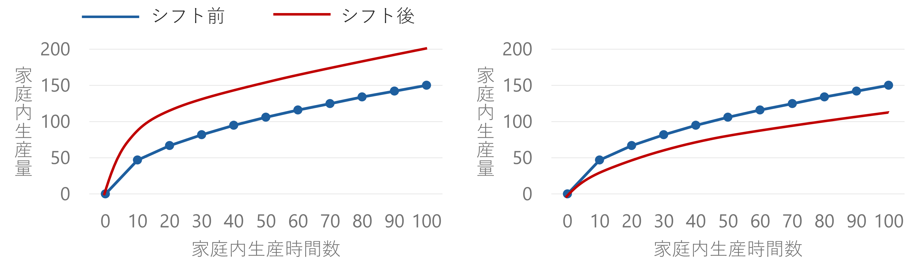
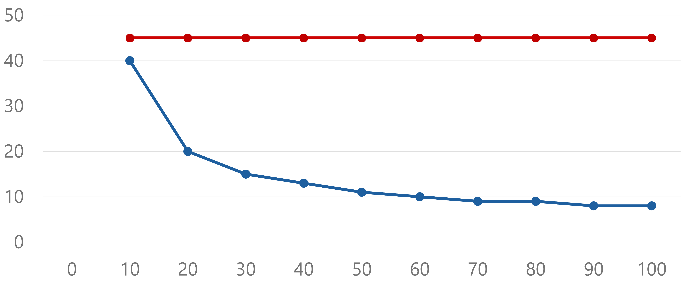
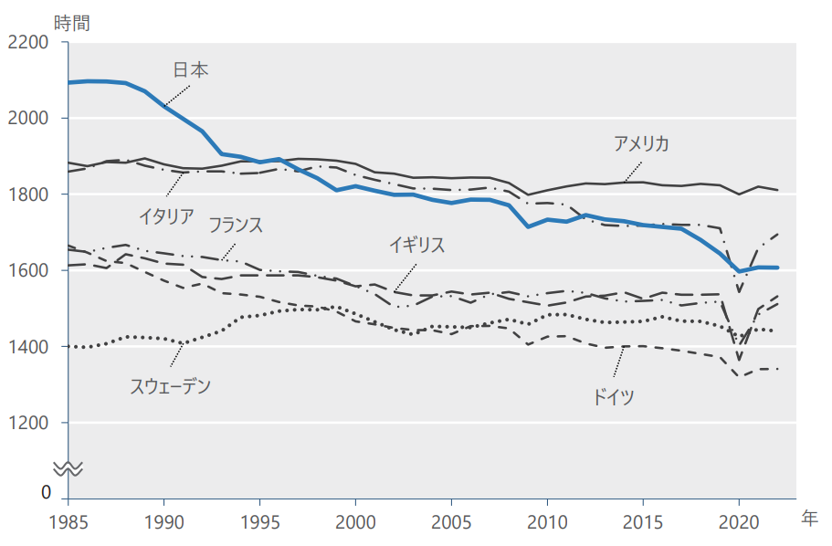
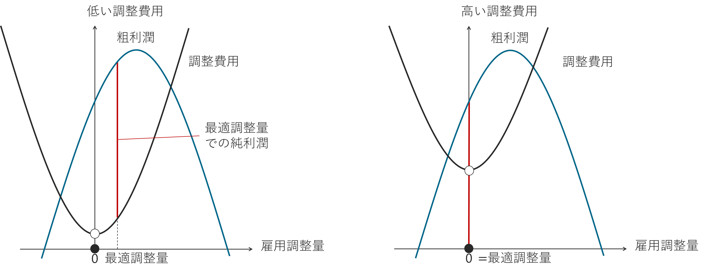

> 本資料は、大森義明・永瀬伸子（2021）『労働経済学をつかむ』（有斐閣）　を参考に作成しています。
> 授業目的に合わせて一部構成や表現を調整しています。

本章では労働経済学の土台として、「労働市場とは何を指すのか」、そして「労働市場における需要と供給によって何が決まるのか」を取り上げます。
以降の議論すべての基礎となる部分なので、ここでしっかり理解しておきましょう。

# 労働市場のモデル

ここまで何度も「労働市場」という語が登場していますが、そもそも労働市場とは何を指すのでしょうか。

::: {.callout-note appearance="default" icon="false"}
## 労働市場

働きたい人が仕事を探し（**求職**）、企業が人を雇いたいと考えて求人を出し、その結果として労働力のやり取りが行われる場のこと

:::

もっとも、労働市場という固有の場所が実在するわけではなく、魚市場のように労働者に値がつけられ、価格（時間あたり賃金）が目に見える形で変動するわけでもありません。

とはいえ、求職者の数に比べて求人が多ければ時間の経過とともに時給は上がっていき、逆に求人が少なければ時給は下がっていく、という関係があります。

> 一例として、新型コロナの感染拡大前にあたる2015〜2019年には、求職者1人あたりの求人数を示す有効求人倍率が1.2から1.6へと上昇し[^jor]、同じ期間に三大都市圏のアルバイト・パート募集時の平均時給も981円から1084円へ上がりました[^partwage]。

[^jor]:労働政策研究・研修機構（JILPT）.（2025）. *完全失業率・有効求人倍率*. [https://www.jil.go.jp/kokunai/statistics/timeseries/html/g0301.html](https://www.jil.go.jp/kokunai/statistics/timeseries/html/g0301.html)
[^partwage]:リクルート・リサーチセンター.（n.d.）. *アルバイト・パート募集時平均時給調査*. [https://jbrc.recruit.co.jp/data/ap/](https://jbrc.recruit.co.jp/data/ap/) （2025年8月5日アクセス）

このように、「求人を出す」「応募する」というやり取りが行われる概念的な場として労働市場を捉えることで、財・サービスの市場と同様に、そこで起きている動きをデータをもとに分析できるようになります。

労働市場における雇用量と賃金は、

- 企業が出す求人数の増減
- 働きたい人の数の増減

によって決まります。

こうした決定のしくみを表すために、**横軸に雇用量**、**縦軸に賃金**をとった**労働市場のモデル**を用います。

::: {.callout-note appearance="default" icon="false"}
## 労働市場のモデル

（市場全体の）**労働供給曲線**

- ある賃金水準のもとで、その労働市場に属する労働者一人ひとりが働きたいと考える労働量を合計したもの（**労働供給量**）
- 提示される賃金が高くなるほど、働きたいと考える人の数や1人あたりの希望労働時間は増え（労働供給の増加）、賃金が低くなるほどそれらは減る（労働供給の減少）ため、労働供給曲線は右上がりの形になる

（市場全体の）**労働需要曲線**

- ある賃金水準のもとで、各企業が利潤を最大化する観点から雇いたいと考える労働量を、市場全体の企業について合計したもの（**労働需要量**）
- 提示される賃金が高いときは各企業が雇いたい労働量が減り（労働需要の減少）、賃金が低いときは増える（労働需要の増加）ため、**労働需要曲線**は右下がりの形になる

:::

賃金と雇用量は、この2本の曲線が交わる点（需要と供給が釣り合う点）で決まります。それ以外の点では、労働供給の方が多い状態（**失業**が発生）か、労働需要が満たされない状態（企業に**欠員**が発生）のどちらかになります。

- 失業：労働供給$>$労働需要となっているため、賃金には下落圧力がかかる
- 欠員：労働供給$<$労働需要となっているため、賃金には上昇圧力がかかる

こうした圧力の結果、市場の賃金と雇用量は2曲線の交点に向かって調整されていきます。

- 交点のことを**均衡**点と呼ぶ
- 交点での賃金：**均衡賃金**（$W^*$）
- 交点での雇用量：**均衡雇用量**（$L^*$）

::: {.quizbox}

**確認クイズ：**

次の文の空欄を埋めてください。

ある賃金が与えられたときに、その賃金のもとで雇用したい労働量を表した曲線を __<input type="text" class="fill-in" id="dep" placeholder="ここに入力">__ 、その賃金のもとで働きたい労働者の量を表した曲線を __<input type="text" class="fill-in" id="sup" placeholder="ここに入力">__ という。

均衡における賃金と雇用量は __<input type="text" class="fill-in" id="equib" placeholder="ここに入力">__ で決まり、そのとき、労働者の需要量と供給量は __<input type="text" class="fill-in" id="eq" placeholder="ここに入力">__ 。

---

**選択肢**

労働者　労働需要曲線　労働供給曲線　時間当たり賃金　市場均衡　均衡点　生産性　景気循環　一致する　労働供給量の方が多い　労働需要量の方が多い

<button onclick="showAnswer('lsd')">答えを見る</button>

労働需要曲線・労働供給曲線・均衡点・一致する

:::

## 労働需要曲線・労働供給曲線のシフト

労働需要曲線と労働供給曲線は、景気の状況や人々の好みの変化に応じて位置が変わる（**シフト**する）ことがあります。

シフトが起きる前の均衡雇用量を$L_1$、均衡賃金を$W_1$とします。

たとえば景気が良くなると、同じ賃金水準でも労働者を雇いたい企業が増える（**労働需要の増加**）ため、**労働需要曲線が右上方向にシフト**します。

このとき、

:::{.seminar-steps}
1. シフト前の均衡賃金$W_1$のもとで企業が雇いたい労働者数は、$L_1$から$L_3$へ増加する
2. しかし$W_1$のもとで働きたい労働者数は$L_1$のまま変わらない
3. その結果、企業に欠員が生じ、賃金には上昇圧力がかかる
4. この圧力は賃金が$W_2$まで上がるところまで続き、最終的にシフト後の需要曲線と供給曲線の交点で新たな均衡に落ち着く
:::

$\rightarrow$ 賃金は$W_1$から$W_2$へ上昇し、雇用量も$L_1$から$L_2$へ増加する

好況以外にも、特定の財・サービスに対する需要の高まりや、技術革新・産業構造の変化などが労働需要をシフトさせる要因になります。

逆に、景気後退や特定産業での需要減少が起きれば、**労働需要が減少し、労働需要曲線は左下方向にシフト**します。

では、労働供給曲線がシフトすると何が起きるのでしょうか。

たとえば、自国民と同等の労働を提供できる移民労働者の流入が何らかの理由で増えたとすると、同じ賃金水準でも働きたい人の数が増える（**労働供給の増加**）ため、**労働供給曲線は右下方向にシフト**します。

このとき、

:::{.seminar-steps}
1. シフト前の均衡賃金$W_1$のもとで働きたい労働者数に対して、需要されている雇用量はそれより少なくなる
2. 失業が発生し、賃金には下落圧力がかかる
3. この圧力は賃金が$W_4$まで下がるところまで続き、最終的に需要曲線とシフト後の供給曲線の交点で新たな均衡に落ち着く
:::

$\rightarrow$ 賃金は$W_1$から$W_4$へ下落し、雇用量は$L_1$から$L_4$へ増加する

このほか、家電製品の発達によって家事の負担が軽くなったり、人口が増えたりして、同じ賃金でも働きたい人が増えるようなときにも労働供給曲線はシフトします。

供給曲線の傾き具合は、人によって違うと考えられています。

- 傾きが緩やか：わずかな賃金上昇でも労働供給が大きく増える
- 傾きが急：賃金が多少上がっても労働供給はあまり増えない

たとえば、

- パート労働者は、正社員と比べて傾きが緩やかだとされている
  - 賃金が上がると、それまで働いていなかった層が新たに働きに出てくるため、労働供給が大きく増える
- 医師は、かなり急な傾きを持つと考えられている
  - 医師として働くには国家資格が必要で、資格を持ち働ける人はすでに大半が就業しているため

::: {.quizbox}

**確認クイズ：**

次の文の空欄を埋めてください。

労働需要が減少すると、労働需要曲線は __<input type="text" class="fill-in" id="dl" placeholder="ここに入力">__ にシフトする。シフト前と比較して、シフト後の均衡賃金は __<input type="text" class="fill-in" id="down" placeholder="ここに入力">__ し、均衡雇用量は __<input type="text" class="fill-in" id="fewer" placeholder="ここに入力">__ する。

---

**選択肢**

右上　右下　左上　左下　上昇　下落　増加　減少

<button onclick="showAnswer('shift')">答えを見る</button>

左下・下落・減少

:::

# 労働供給

## 労働供給モデル

ここからは、先ほど見た労働供給曲線の傾きの違いがなぜ生まれるのか、また労働供給という行動がどのように決まるのかを考えていきます。

::: {.callout-note appearance="default" icon="false"}

## 労働供給

- **マクロ経済学の視点**：
  - 就業している、あるいは仕事を探している人の総数
  - その人たちが提供している労働時間の合計
- **ミクロ経済学の視点**：
  - 個人が仕事を探して働くか働かないかの選択
  - 働く場合に何時間働くかの意思決定の結果

:::

こうした個人レベルの意思決定を扱うのが**労働供給モデル**です。

以下では、労働供給モデルの土台となる**5つの概念**を順に確認します。最後にこれらを組み合わせて、労働供給がどのように決まり、どのような要因で変化するのかを見ていきます。

::: {.seminar-steps}
1. **財と効用**
2. **労働と余暇のトレードオフ**
3. **予算制約線**
4. **無差別曲線**
5. **限界原理**
:::

### 1. 財と効用

そもそも、人が働くもっとも根本的な理由は生活していくためです。

労働力を提供する $\rightarrow$ その対価として所得を得る $\rightarrow$ その所得で財・サービスを消費する $\rightarrow$ 財・サービスの消費から**効用**を得る

という流れです。

::: {.callout-note appearance="default" icon="false"}

## 効用

消費者が財・サービスを消費することで得る満足度のこと

:::

ここでは財・サービスの中身自体は問題にせず、以降は「財・サービス」をまとめて単に「財」と表記します。

### 2. 労働と余暇のトレードオフ

長時間働くと、どのようなことが起きるでしょうか。

- 長時間働く $\rightarrow$ 所得が増える $\rightarrow$ 消費できる財が増える $\rightarrow$ 効用が上がる
- 長時間働く $\rightarrow$ 余暇（働かない時間）が犠牲になる $\rightarrow$ 余暇からの効用が得られなくなる

::: {.callout-note appearance="default" icon="false"}

## 労働供給モデルにおける前提

**個人は消費と余暇のトレードオフ**（一方を増やせばもう一方を減らさざるを得ない関係）**を踏まえたうえで、自分の効用が最大になるように労働供給**（労働時間や労働日数）**を選ぶ**

:::

以下では、財の消費・余暇のどちらも効用を高めるものと仮定します。裏を返せば、長時間働くこと自体は効用を下げる方向に働くという仮定でもあります。財と余暇の両方が効用を高めるからこそ、両者の間にトレードオフという問題が生じるのです。

::: {.callout-tip appearance="default" icon="false"}
## 例：大学生のアルバイト

大学2年生のタカシは、実家から毎月8万円（週あたり2万円）の仕送りを受けながら一人暮らしをしています。
それだけでは生活費が足りないため、時給1000円のアルバイトを始めようと考えています。

ここで、アルバイトに使える時間には次のような制約があります。

- 1週間はすべて合わせて168時間（24時間×7日）
- 生活や学業に欠かせない時間を差し引く必要がある
  - 健康を保つには最低でも週70時間（1日の睡眠7時間、食事や身支度に3時間、計10時間×7日）
  - 授業に出るには週20時間（1コマ90分×週8コマ）
  - あわせて週90時間が必要
    - これが余暇の下限にあたると考えられる

$\rightarrow$ 残りは78時間

:::

つまりこの例では、タカシがアルバイトに充てられる時間は最大でも週78時間までに制約されており、その78時間の中で**何時間働くか**、そして**残りの何時間を余暇**（友人と過ごす時間、趣味、自主的な勉強時間[^benkyo]といったアルバイト以外の時間）**に充てるか**を決める必要があります。

[^benkyo]: 学生にとって自主的な勉強は本業と言えるかもしれませんが、賃金の発生する労働時間ではないため、ここでは余暇に含めて扱います。

### 3. 予算制約線

アルバイトに何時間充てるか（労働供給量）を決めるうえで、タカシはもう一つ別の制約にも直面しています。それが**総収入と余暇時間の間のトレードオフ**です。

先ほどの例をもとに、両極端なケースを考えてみましょう。

**1. 週78時間すべてをアルバイトに使う**
  - 月78,000円を稼げて生活は楽になる
  - 友人と遊んだり趣味に費やしたりする時間はゼロになる
  - 勉強時間が取れず成績が落ちるおそれもある
  - 大学生活を楽しんでいる実感が持てなかったり、何のために働いているのか分からなくなったりするかもしれない
**2. 78時間すべてを余暇に使う**
  - 生活費の不足は解消されない

どちらの極端な選択も、生活の満足度を最大化しているとは言えません。消費から得られる効用と余暇から得られる効用の両方をそれなりに確保できるよう、アルバイトと余暇の時間配分をバランスさせることこそが、消費と余暇のトレードオフを考えるということです。

ここからは、タカシが取りうる選択肢を具体的に見ていきます。

| | | | | | | | | | |
|-------------------|----|----|----|----|----|----|----|----|----|
| 余暇時間数（時間）[^yoka] | 0  | 10 | 20 | 30 | 40 | 50 | 60 | 70 | 78 |
| アルバイト時間数   | 78 | 68 | 58 | 48 | 38 | 28 | 18 | 8  | 0  |
| アルバイト収入（千円） | 78 | 68 | 58 | 48 | 38 | 28 | 18 | 8  | 0  |
| 親からの仕送り収入（千円） | 20 | 20 | 20 | 20 | 20 | 20 | 20 | 20 | 20 |
| 総収入（千円） | 98 | 88 | 78 | 68 | 58 | 48 | 38 | 28 | 20 |

[^yoka]: ここで余暇時間数は、週90時間の必要最低限の余暇時間数を超過する、追加的な余暇時間数を表しています。

この表からも分かるように、タカシが使える時間は週78時間までに限られているため、総収入を増やすにはアルバイトの時間を増やし余暇時間を削る必要があり、逆に余暇時間を増やすにはアルバイトの時間を削る必要があります。

なお、ここではタカシの時給が1000円で一定であることを前提としています。経済学では、この前提のもとにあるタカシのことを**価格受容者**、あるいは**完全競争者**と呼びます。

::: {.callout-note appearance="default" icon="false"}
## 価格受容者とは

一人ひとりの参加者が価格そのものに影響を与えられない状態のこと

次の条件を満たす市場（**完全競争市場**）において生じる

1. 売り手・買い手がともに多数存在する
2. 取引される財が同質である
3. 市場への参入・退出が自由である
4. 情報がすべての参加者に共有されている

こうした市場では、価格は需要と供給の関係によって市場全体で決定される

:::

この図は、先ほどの表をもとに、横軸に余暇時間数、縦軸に総収入をとって、タカシが選べる選択肢を右下がりの直線として描いたものです。先ほどの週78時間すべて働くという極端な選択肢は点A、すべて余暇に充てる選択肢は点Bにそれぞれ対応します。

この直線上には他にも無数の選択肢があり、たとえば点Cは、週38時間アルバイトをして総収入58,000円を得る選択肢に相当します。

経済学では、こうした選択可能なすべての組み合わせを表す右下がりの直線のことを予算制約線（予算線）と呼びます。

::: {.callout-note appearance="default" icon="false"}
## 予算制約線（予算線）

選択可能な総収入と余暇時間数の組み合わせをグラフに表したもの[^budget]

[^budget]: ミクロ経済学で通常学ぶ予算制約線は、縦軸・横軸に2種類の財の消費量をとり、予算の範囲内で購入できる財の組み合わせを示す直線です。この考え方を労働供給量の決定に当てはめると、ここで扱っているような直線になります。

:::

予算制約線より上側の領域は、時間の制約を超えてしまっており、選ぶことのできない組み合わせにあたります。

点Bを選ぶ人は働く意志を持たないため**非労働力**と呼ばれ、それ以外の選択可能な組み合わせ（直線上のいずれかの点）を選ぶ人たちは**労働力**と呼ばれます。

- 予算制約線が右下がりであること $\Leftrightarrow$ 余暇時間を増やすと総収入が減る、というトレードオフの関係にあること
- 予算制約線の傾き（ここでは‐1000円/時） $=$ 余暇を1時間増やすために手放すことになる総収入
  - これを**機会費用**、あるいは余暇の**限界費用**と呼ぶ

::: {.callout-note appearance="default" icon="false" #marginal}
## 「限界（マージナル：marginal）」とは

経済学の基礎概念で、あるものを**追加的に1単位増やしたとき**の、他のものの変化量を表す

**「もう1単位増やしたら？」と考える**

余暇をもう1時間増やす $\rightarrow$ 失う収入はいくら？ $\rightarrow$ 余暇の限界費用

:::

### 4. 無差別曲線

予算制約線によって、タカシが選べる余暇時間数と総収入の組み合わせが明らかになりました。次に考えるべきは、この中でどの組み合わせがタカシの満足度（**効用**）をもっとも高めるかです。

どの選択肢が最善かは、タカシ自身の好み次第で変わります。余暇を重視するタイプなら、アルバイトをしない点Bを選ぶかもしれませんし、収入を増やすことを何より優先するなら点Aを選ぶかもしれません。

このような好みを表現するために、経済学では**無差別曲線**という道具を使います。

::: {.callout-note appearance="default" icon="false"}
## 無差別曲線

効用の水準が等しくなる財・サービスの組み合わせを結んだ曲線のこと。ここでは余暇時間数と総収入の組み合わせを、財・サービスの組み合わせとみなしている。

:::

無差別曲線は効用が等しい組み合わせを結んだ線なので、同じ曲線上であればどの点を選んでもタカシの満足度は変わりません。

たとえば無差別曲線 $U_{1}$ 上を見ると、余暇時間数と総収入の組み合わせ $(余暇, 総収入)$ について、$(10時間, 80千円)$ と $(20時間, 60千円)$ はどちらも同程度に望ましいということになります。

無差別曲線には、次のような重要な性質があります。

::: {.seminar-steps}
1. **無差別曲線は右下がり**

   余暇時間数が増えると効用は上がるため、同じ無差別曲線上で効用を一定に保つには、その分総収入を減らす必要がある

   - 無差別曲線の傾き（の絶対値）は、タカシが追加的な1時間の余暇と引き換えにしてもよいと考える総収入の減少幅を表す。これを**限界代替率**と呼ぶ

2. **無差別曲線は原点に向かって凸型**

   「[限界](#marginal)」の考え方を使うと、余暇を追加的に1時間増やしたときに得られる効用の増加分を**余暇の限界効用**と呼ぶことができる
  
   - 余暇が少ないときにもう1時間余暇が増えることの価値は大きい
   - 一方、すでに余暇時間数が多い状態からもう1時間余暇が増えることの価値は小さい

   このように、余暇が増えることの限界効用が小さくなることを**限界効用逓減**と呼ぶ

   - 余暇が増えるにつれ「余暇を1時間増やすために手放しても良い総収入」も減少する（無差別曲線は次第に平らになる）

3. **右上に位置する無差別曲線 $=$ より高い効用水準**

   図では、$U_{2}$ よりも $U_{1}$ の方が効用が高い

   - 同じ余暇時間数20時間で比較すると
     - $U_{1}$ 上では総収入が60千円
     - $U_{2}$ 上では総収入が44千円
   $\rightarrow$ したがって $U_{1}$ の方が効用が高い

4. **無差別曲線は交差しない**

   もし2本の曲線が交わるとすると、交点を境に一方が「より効用が高い（右上）」と同時に「より効用が低い（左下）」ことになってしまい、同一曲線上では効用が一定であるという定義と矛盾するため
:::

### 5. 限界原理 {#mrule}

::: {.callout-tip appearance="default" icon="false"}
## 例：タカシにとっての最適な選択肢を予測する

タカシが取り得る選択肢を表す予算制約線と、タカシの好みを表す無差別曲線を組み合わせることで、タカシにとって最適な選択（最適な労働供給量）を予測するモデルを考えます。

ここでは、余暇をもう1時間増やすことで得られる価値と、そのために失う総収入を比較します。

経済学では、ある行動を追加的に1単位増やすことで得られる価値を一般に**限界便益**と呼びます。
この例では、余暇の限界便益は「余暇をもう1時間増やすために、どれだけの総収入を手放してもよいか」で表され、無差別曲線の傾きの絶対値(限界代替率)にあたります。

タカシが選べるのは予算制約線上の組み合わせなので、まず余暇10時間（労働68時間）の状態から、余暇を少しずつ増やしていく場合を考えてみます。

- $(余暇, 総収入) = (10時間, 88千円)$
  - 余暇の限界便益（無差別曲線の傾きの絶対値） $>$ 限界費用（予算制約線の傾きの絶対値）

  $\rightarrow$ 余暇を増やし総収入を減らした方がよい

- $(余暇, 総収入) = (20時間, 78千円)$
  - 余暇の限界便益 $>$ 限界費用

  $\rightarrow$ 余暇を増やし総収入を減らした方がよい

つまり、余暇の限界便益が限界費用を上回っている間は、余暇を追加することで得られる効用の方が大きいため、余暇を増やして総収入を減らす方が望ましいということになります。

無差別曲線の性質上、余暇の**限界効用は逓減**するため、余暇をもう1時間増やすことの**限界便益も小さく**なっていきます。
一方、限界費用は時給1000円で一定なので、どこかの時点で**余暇の限界便益 $=$ 限界費用**となります。

反対に、余暇70時間（労働8時間）の状態から、余暇を少しずつ減らしていく場合も考えてみます。

- $(余暇, 総収入) = (70時間, 28千円)$
  - 余暇の限界便益 $<$ 限界費用

  $\rightarrow$ 余暇を減らし総収入を増やした方がよい

- $(余暇, 総収入) = (60時間, 38千円)$
  - 余暇の限界便益 $<$ 限界費用

  $\rightarrow$ 余暇を減らし総収入を増やした方がよい

こちらは先ほどと逆に、余暇の限界便益が限界費用を下回っている間は、余暇を増やしても得られる効用が限界費用に見合わないため、余暇を減らして総収入を増やす方が望ましいことになります。

このように余暇を減らしていく場合も、どこかの時点で**余暇の限界便益 $=$ 限界費用**となる点にたどり着きます。
:::

このように、余暇が少ない側から増やす場合も、余暇が多い側から減らす場合も、最適な選択は**余暇の限界便益 $=$ 限界費用**となる点で実現することが分かります。

この点では、余暇をこれ以上増やしても減らしても効用を高めることができないため、タカシにとって最適な選択となります。

このとき、タカシの**効用は、予算制約線と最適点で接する無差別曲線**（$U^*$）によって表されます。最適な選択のもとで効用が最大化されている以上、その無差別曲線は予算制約線と交わる無差別曲線の中でもっとも右上に位置しているはずだからです。

図の無差別曲線がタカシの好みを正確に表しているとすれば、$(余暇, 総収入) = (25時間, 73千円)$ という組み合わせが、タカシにとって効用がもっとも高くなる最適な選択ということになります。

このように、限界便益 $=$ 限界費用となる点で最適な選択が実現するという事実は、経済学では**限界原理**として知られています。

::: {.callout-note appearance="default" icon="false"}
## 限界原理

トレードオフの関係にある物事において、追加的な1単位から得られる便益（**限界便益**）と、追加的な1単位にかかる費用（**限界費用**）を比較して意思決定する

  - 限界便益 $>$ 限界費用：1単位を増やす
  - 限界便益 $<$ 限界費用：1単位を減らす
  - **限界便益** $=$ **限界費用：最適な選択**

:::

余暇時間数と総収入の配分をめぐる意思決定において、これは**余暇の限界便益 $=$ 限界費用**となる点で最適な選択が実現するということに対応します。

::: {.callout-important appearance="default" icon="false"}
## まとめ：労働供給モデル

- 個人の視点に立って労働供給量の決定を分析するモデルを**労働供給モデル**と呼ぶ
- 余暇と総収入はトレードオフの関係にあるため、個人は**予算制約線**（選べる範囲）と**無差別曲線**（個人の好み）を組み合わせ、**効用が最大になる**ような最適な余暇時間数（労働供給量）を選ぶ
  - **予算制約線**：個人が選べる総収入と余暇時間数の組み合わせを表す曲線
  - **無差別曲線**：個人にとって効用が等しくなる総収入と余暇時間数の組み合わせを表す曲線
- 最適な労働供給量は、**余暇の限界便益 $=$ 限界費用**となる点で実現する（**限界原理**）
  - 余暇の限界便益は、無差別曲線の傾きの絶対値（限界代替率）として表される

:::

::: {.quizbox}

**確認クイズ：**

Aさんの余暇の限界便益が以下の表で与えられているとき、Aさんは時給2000円の仕事に全体の時間の何%を割り当てるのが最適か求めてください。

| | | | | | | | | | | | |
|-------------------|----|----|----|----|----|----|----|----|----|----|----|
| 従事時間（%） | 0  | 10 | 20 | 30 | 40 | 50 | 60 | 70 | 80 | 90 | 100 |
| 余暇時間（%） | 100 | 90 | 80 | 70 | 60 | 50 | 40 | 30 | 20 | 10 | 0 |
| 余暇の限界便益（千円） | 0.2 | 0.6 | 0.8 | 1 | 1.5 | 2 | 4 | 8 | 12 | 16 | 20 |

__<input type="text" class="fill-in" id="50" placeholder="ここに入力">__ %

<button onclick="showAnswer('mb')">答えを見る</button>

50

:::

## 所得・賃金の変化と労働供給

基本的な労働供給モデルを理解したところで、次は周囲の環境が変化したとき、タカシが選択をどう変えるかを見ていきます。ここでは**3つのケース**を順に分析します。

::: {.seminar-steps}
1. **非労働所得が増えるケース**
2. **賃金が上がるケース**
3. **賃金と労働時間の関係**
:::

### 1. 非労働所得が増えるケース

まず、親からの仕送りが増えるケースから考えましょう。

仕送りが週3万円に増額されると、タカシが選べる選択肢は次のように変化します。

| | | | | | | | | | |
|-------------------|----|----|----|----|----|----|----|----|----|
| 余暇時間数（時間） | 0  | 10 | 20 | 30 | 40 | 50 | 60 | 70 | 78 |
| アルバイト時間数   | 78 | 68 | 58 | 48 | 38 | 28 | 18 | 8  | 0  |
| アルバイト収入（千円） | 78 | 68 | 58 | 48 | 38 | 28 | 18 | 8  | 0  |
| **親からの仕送り収入（千円）** | 30 | 30 | 30 | 30 | 30 | 30 | 30 | 30 | 30 |
| **総収入（千円）** | 108 | 98 | 88 | 78 | 68 | 58 | 48 | 38 | 30 |

このとき、予算制約線は次の図のように変化します。

仕送りが週2万円だったときの予算制約線（青い直線）と比べ、新しい予算制約線（赤い直線）は1万円分だけ上方に平行移動しています。

アルバイトの時給（余暇の機会費用）自体は1000円のまま変わらないため、傾きは変化しません。

経済学では、親からの仕送りのような**非労働所得**が増えると、人はより多くの余暇時間を望むようになることが知られています。

- **非労働所得**：働かなくても得られる所得のこと

たとえば、仕送りが増える前は点Aを選んでいたとすると、増えた後にはタカシは点Bのような選択に移るでしょう。

これは、余暇が、所得が増えたときに消費を増やしたくなるタイプの財（**正常財**）にあたるためです。

::: {.callout-note appearance="default" icon="false"}
## 正常財と劣等財

- 正常財（上級財）：所得が増えると消費量（需要量）が増える財
- 劣等財（下級財）：所得が増えると消費量（需要量）が減る財

:::

多くの研究から余暇は正常財であることが分かっており、所得が増えるほどより多くの余暇を消費したくなる傾向があります。これを**所得効果**と呼びます。

::: {.callout-note appearance="default" icon="false"}
## 所得効果

所得の変化が需要量に及ぼす効果のこと

正常財であれば需要量を押し上げ、劣等財であれば需要量を押し下げる

:::

### 2. 賃金が上がるケース {#wage-up}

続いて、アルバイトの時給が上がるケースを考えます。

時給が1000円から1500円へ引き上げられると、タカシの選択肢は次のように変化します。

| | | | | | | | | | |
|-------------------|----|----|----|----|----|----|----|----|----|
| 余暇時間数（時間） | 0  | 10 | 20 | 30 | 40 | 50 | 60 | 70 | 78 |
| アルバイト時間数   | 78 | 68 | 58 | 48 | 38 | 28 | 18 | 8  | 0  |
| **アルバイト収入（千円）** | 117 | 102 | 87 | 72 | 57 | 42 | 27 | 12 | 0 |
| 親からの仕送り収入（千円） | 20 | 20 | 20 | 20 | 20 | 20 | 20 | 20 | 20 |
| **総収入（千円）** | 137 | 122 | 107 | 92 | 77 | 62 | 47 | 32 | 20 |

このとき、予算制約線は次の図のように変化します。

時給1000円のときの予算制約線（青い直線）と比べると、新しい予算制約線（赤い直線）は右下の点を軸に時計回りへ回転したような形になっています。

傾きが変わるのは、時給が1000円から1500円に上がったことで、余暇の機会費用も同じく1000円から1500円へ増えるためです。

時給が上がったとき、タカシがより少ない余暇（より多くのアルバイト）を望むようになるとは限らず、逆により多い余暇（より少ないアルバイト）を望むようになる可能性もあります。

たとえば時給上昇前に点Aを選んでいたとすれば、点Bに移る可能性も、点Cに移る可能性もあるということです。

- 点Bを選ぶ場合（アルバイトを増やし余暇を減らす）

  時給上昇 $\rightarrow$ 余暇の機会費用が上がる $\rightarrow$ 余暇を減らしたくなる（**代替効果**）

- 点Cを選ぶ場合（余暇を増やしアルバイトを減らす）

  時給上昇 $\rightarrow$ 短時間でより多く稼げる $\rightarrow$ 生活にゆとりが生まれる $\rightarrow$ 同じ余暇時間でも得られる総所得が増える $\rightarrow$ もっと余暇を消費したくなる（**所得効果**）

::: {.callout-note appearance="default" icon="false"}
## 代替効果

財の相対価格が変化したとき、価格が相対的に高くなった財の需要量を減らし、安くなった財の需要量を増やす効果

:::

ここでは、余暇の機会費用（相対価格）が上がったことによって、余暇を減らし労働供給を増やそうとする効果を指します。

時給が上がるとき、タカシには代替効果を通じて余暇を減らす（アルバイトを増やす）方向の力と、所得効果を通じて余暇を増やす（アルバイトを減らす）方向の力の両方が働きます。そのため、結果としてタカシが余暇を増やすか減らすかは一概には決まりません。

- 「代替効果 $>$ 所得効果」の場合は余暇時間数が減少
- 「代替効果 $<$ 所得効果」の場合は余暇時間数が増加

この代替効果と所得効果を合わせたものを**総合効果**と呼びます。

### 3. 賃金と労働時間の関係

[2. 賃金が上がるケース](#wage-up)で見たように、一般的にはアルバイトの時給が上がっても、タカシがアルバイト時間を増やすとは限りません。

ただし、タカシがまったく働いていない状態であれば、時給が十分に上がったとき、タカシは必ずアルバイトを始めます。

アルバイトをしていない $\rightarrow$ 時給が上がっても総所得は増えない $\rightarrow$ 所得効果は生じず代替効果のみが働く $\Leftrightarrow$ 余暇を減らしてアルバイトを増やす方向の圧力しか生まれない

実際にどの時給水準でアルバイトを始めるかは個人の好みによって異なりますが、時給が十分に上がれば、タカシはいずれアルバイトを始めることになります。

::: {.callout-note appearance="default" icon="false"}
## 留保賃金

ある人を働く気にさせる最低限の賃金水準

- 言い換えれば「働いていないときの最初の1時間を自分のために使うことの価値」

:::

一般に、所得効果の大きさはアルバイト時間数が増えるほど大きくなります。実際、時給1000円と1500円のケースで総収入の差を比べると、次のようになります。

| | | | | | | | | | |
|-------------------|----|----|----|----|----|----|----|----|----|
| アルバイト時間数   | 78 | 68 | 58 | 48 | 38 | 28 | 18 | 8  | 0  |
| 総収入（千円）：時給1000円 | 98 | 88 | 78 | 68 | 58 | 48 | 38 | 28 | 20 |
| 総収入（千円）：時給1500円 | 137 | 122 | 107 | 92 | 77 | 62 | 47 | 32 | 20 |
| 総収入（千円）の差 | 39 | 34 | 29 | 24 | 19 | 14 | 9 | 4 | 0 |

つまり、時給とアルバイト時間数（**賃金と労働供給**）**の関係は一様ではない**ということです。

アルバイト時間数が多いとき

 1. 所得効果が大きくなる
 2. 「所得効果 $>$ 代替効果」になりやすい
 3. さらに時給が上がっても、アルバイトを減らして余暇を増やす方向の圧力が働く

アルバイト時間数が少ないとき

 1. 代替効果が大きくなる
 2. 「代替効果 $>$ 所得効果」になりやすい
 3. 時給が十分に上がれば、余暇を減らしてアルバイトを増やす方向の圧力が働く

まとめると、アルバイト時間数がある程度までは代替効果が優勢になりやすく労働供給は増加しますが、それを超えると所得効果が優勢になりやすく労働供給は減少に転じます。

::: {.callout-note appearance="default" icon="false"}
## 個人の労働供給曲線

横軸に労働供給量、縦軸に賃金をとり、個人の労働供給量と賃金の関係を表したもの

途中で折れ曲がって後方に反っているものは**後屈労働供給曲線**と呼ばれる

:::

::: {.callout-important appearance="default" icon="false"}
## まとめ：所得・賃金の変化と労働供給

所得・賃金の変化と労働供給の間には、2つの力が働きます。

- **代替効果**
  - 賃金が上がると余暇の機会費用が高まる

   $\rightarrow$ 余暇を減らして労働供給を増やす方向に働く

- **所得効果**
  - 非労働所得が増える、あるいは賃金上昇によって短時間でも高い所得を得られるようになる

   $\rightarrow$ 生活にゆとりが生まれ余暇を増やす方向に働く

最終的にどちらの力が優勢かは人によって異なります（**総合効果**）。

一般に、労働供給量がすでに多い人ほど所得効果が働きやすくなります。

- 労働供給量が多い人：「所得効果 $>$ 代替効果」になりやすい $\rightarrow$ 賃金が上がると労働供給量を減らす
- 労働供給量が少ない人：「所得効果 $<$ 代替効果」になりやすい $\rightarrow$ 賃金が上がると労働供給量を増やす

この結果として、**後屈的な労働供給曲線**が生まれます。

**まだ働いていない人**は、賃金が十分に高まれば働き始めます。

- この働き始めるボーダーラインとなる賃金水準を**留保賃金**と呼ぶ

:::

## 労働供給モデルの応用：有配偶女性の職業選択

労働供給モデルは、さまざまな場面に応用することができます。

- 高齢者や女性が就業するかしないかの選択
- 政府の政策や企業の施策が労働供給に及ぼす影響
- 労働供給が時間とともにどう変化してきたか
- 格差の理解（男女・年齢・学歴・産業・職業・地域などの間の差）

ここでは例として、配偶者のいる女性の就業選択を取り上げます。
経済学ではこれまで、女性（とりわけ既婚女性）が自身のキャリアを築きながら賃金収入を求めて働くのか、家庭内で家事・育児・介護といった賃金を伴わない形で働くのか、あるいは家計を補助する程度に働くのかという点に、大きな関心が寄せられてきました。

かつては、結婚を機に仕事を辞めて家庭内労働を選ぶ女性が多数派でした。この傾向は、[はじめに-労働力率](labor_intro.html#年齢階級別労働力率)で見たような労働力率のM字型カーブに表れています。

現在では、多くの先進国で賃金収入を求めて働く女性が大きく増えています。これも、海外で見られるようになった高原型の労働力率カーブに反映されています。

とはいえ、日本の女性の年齢階級別労働力率を見ると、依然として育児期に労働力が落ち込む傾向が残っています。ただし近年は、無配偶女性の労働力率は高原型に近づいてきています。

配偶者のいる女性の就業選択は、さまざまな要因の影響を受けます。

- 働かなくても生計を維持できる収入がどれだけあるか（夫の収入に対する裁量権など）
- 働いた場合に手元に残る賃金の水準
- 賃金以外にやりがいなどの便益がどれだけ得られるか
- 家庭内の労働から得られる便益がどれだけあるか
- 保育園・学童などの整備状況や利用にかかる費用
- 育児休業制度の内容
- 社会保障や税制（手取り額に影響するため）
  - 年収103万円の壁：所得税などが課されない範囲
  - 年収130万円の壁：社会保険料が免除されつつ基礎年金の受給権や医療給付を受けられる範囲
- 社会規範
- 教育を通じて形成される価値観

次の章では、「家庭内生産」という要素も組み込んで労働供給を分析していきます。

::: {.quizbox}

**確認クイズ：**

労働供給モデルを使い、夫の失業が非労働力状態にある妻の就業に与える効果を分析してみましょう。
次の空欄に適切な語句を入れてください。
ただし、夫の失業は妻が働かなくとも生計維持に使える収入を減らすとします。

非労働力状態にある妻は、 __<input type="text" class="fill-in" id="0" placeholder="ここに入力">__ が0の状態を選んでいると考えることができる。
夫の失業は妻の __<input type="text" class="fill-in" id="nlinc" placeholder="ここに入力">__ を減らし、予算制約線を __<input type="text" class="fill-in" id="dl" placeholder="ここに入力">__ に平行移動させるので、この移動が十分大きなものであれば、妻は労働力化するような状態を選ぶようになる。

---

**選択肢**

労働供給量　労働需要量　賃金　労働所得　非労働所得　右上　右下　左上　左下　時給　社会保険料　

<button onclick="showAnswer('wife')">答えを見る</button>

労働供給量・非労働所得・左下

:::

# 労働と家庭内生産

## 家庭内生産モデル

ここまでの章では、賃金が発生する労働と余暇という2つの活動しかない世界を想定してきました。

しかし実際には、出産を機にいったん無職になったり育児休業を取得したりする女性が半数近くにのぼります。
こうした人たちは時間のすべてを余暇に充てているわけではなく、家事・育児・介護といった家庭内での生産活動に時間を使っています。
余暇は消費にあたる活動ですが、家事・育児・介護は生産にあたる活動です。家事代行サービスや介護事業者に依頼すれば料金が発生する、つまり賃金労働として成立しうる活動だからです。
そこで本章では、賃金の発生する労働とこれらの活動を明確に区別して考えます。

- 市場労働：賃金が発生する労働
- 家庭内生産活動：賃金の発生しない家庭内での労働

そのうえで、財は市場で購入することも、家庭内での生産によって手に入れることもできるものとします。

ここでは、

- 個人が市場労働時間・家庭内生産活動時間・余暇時間をどのように配分するか
- 現代においてなぜ市場労働をする女性が増えているのか

について**家庭内生産モデル**を用いて考えていきます。

### 1. 家庭内生産と市場財の購入

市場労働時間と家庭内生産活動時間の配分は、1日・1週間・1年の単位でどれだけ働きどれだけ家事・育児に充てるか、あるいは生涯を通じて何年働き何年家事・育児に充てるかという時間配分の問題でもあります。

ここでも財から効用を得るというモデルの枠組みを使いますが、これまでとの違いは、財が家庭内でも生産できるという点です。

::: {.callout-note appearance="default" icon="false"}
## 家庭内生産モデル

個人の効用が、市場で購入できる財と余暇に加えて、家庭内での生産物によっても決まるとするモデル

:::

家庭内で生産できる財の例

- 家庭菜園で育てる野菜
- 自分で作る服
- 自分の手で行う子育て
- 自分で作る料理

> ※市場で購入する財より品質が劣ることもあり得ますが、単純化のためここでは財の質はすべて同一だと仮定します。

::: {.callout-tip appearance="default" icon="false"}
## 例：単身者の家庭内生産

マミはもうすぐ大学を卒業します。彼女は、時間を家庭内生産活動に充てて自分で財を生み出すこともできますし、仕事に出てその収入で財を購入することもできます。

市場労働時間と家庭内生産活動時間に充てられる時間は最大100時間

- 1週間は168時間（$=24時間\times7日$）
- そのうち生存に必要な時間が68時間

家庭内生産活動

- 部屋の掃除や食事の準備など
- 最初の数時間は1時間あたりの生産性が高いが、時間をかけるほど1時間あたりの生産性は落ちていく（**限界生産性の逓減**）
  - 例：最初の10時間の掃除で部屋は見違えるように片付くが、20時間もかけると掃除する場所がもうなくなってくる
    - 時間を2倍かけても、快適さが2倍になるわけではない

市場労働

- 一定の時給（1500円）で働ける

市場財

- 価格は1000円

:::

このとき、マミは市場労働と家庭内生産活動にそれぞれ何時間ずつ充てるでしょうか。

**家庭内生産時間と生産量の関係**

| | | | | | | | | | | | |
|-------------------|----|----|----|----|----|----|----|----|----|----|----|
| 家庭内生産時間数（$H$） | 0 | 10 | 20 | 30 | 40 | 50 | 60 | 70 | 80 | 90 | 100 |
| 家庭内生産量（$Q$） | 0 | 47 | 67 | 82 | 95 | 106 | 116 | 125 | 134 | 142 | 150 |
| 家庭内限界生産量 | $-$ | 47 | 20 | 15 | 13 | 11 | 10 | 9 | 9 | 8 | 8 |

上の表は、マミの1週間あたりの家庭内生産時間数と家庭内生産量の関係を示したものです。
この例では、家庭内生産時間数 $H$ から得られる生産量 $Q$ が次の式で表されます。

$$
Q = 15\sqrt{H}
$$

家庭内限界生産量は、家庭内生産時間を10時間増やすごとに生産量がどれだけ増えるかを表しています。

::: {.callout-note appearance="default" icon="false"}
## 限界生産量

生産要素（ここでは家庭内生産時間数）を1単位追加的に投入したときに増える生産量

:::

この図は、先ほどの表をもとに、マミの家庭内生産時間数と生産量、家庭内限界生産量の関係をグラフにしたものです。

- 家庭内生産時間数が増えるほど家庭内生産量も増える
- 家庭内生産時間数が増えるほど家庭内限界生産量は減っていく

**市場労働と市場財の関係**

| | | | | | | | | | | | |
|-------------------|----|----|----|----|----|----|----|----|----|----|----|
| 市場労働時間数 | 0 | 10 | 20 | 30 | 40 | 50 | 60 | 70 | 80 | 90 | 100 |
| 労働所得 | 0 | 15 | 30 | 45 | 60 | 75 | 90 | 105 | 120 | 135 | 150 |
| 市場財の購入量 | 0 | 15 | 30 | 45 | 60 | 75 | 90 | 105 | 120 | 135 | 150 |
| **市場労働の限界購入量**[^mcons] | $-$ | 15 | 15 | 15 | 15 | 15 | 15 | 15 | 15 | 15 | 15 |

[^mcons]: 労働時間を10時間増やすごとにどれだけ市場財の購入量が増えるかを示す。

この図は、表をもとに、マミの市場労働時間数と市場財の購入量、市場労働の限界購入量の関係をグラフにしたものです。

- 市場労働時間数が増えるほど市場財の購入量も一定の割合で増える
- 市場労働時間数が増えても市場労働の限界購入量自体は変わらない

### 2. 最適な「市場労働時間」「家庭内生産時間」「余暇」

この状況で、マミはどのように行動するでしょうか。

マミは最終的に「市場労働時間」「家庭内生産時間」「余暇」という3つの活動に時間を配分することになりますが、まずは最適な家庭内生産時間について考えます。

以下の**2段階**で最適解を求めます。

::: {.seminar-steps}
1. **最適な家庭内生産時間数**を先に求める
2. 残った時間を**市場労働時間と余暇**に配分する
:::

**Step 1：最適な家庭内生産時間数**

ここでも[限界原理](#mrule)を用いて考えます。

- 家庭内生産の限界便益は**家庭内限界生産量**、限界費用は**市場労働の限界購入量**にあたる
  - なぜなら、家庭内生産を追加的に10時間行えば家庭内限界生産量の分だけ生産量が増える一方、その10時間分市場労働を行っていれば得られたはずの財の購入量（市場労働の限界購入量）を手放すことになるから
- 限界原理にしたがえば、最適な家庭内生産時間数は「**家庭内限界生産量 $=$ 市場労働の限界購入量**」となる点で決まる
- ここでは家庭内限界生産量 $=$ 市場労働の限界購入量 $=15$ となる**30時間の家庭内生産が最適**となる

これをグラフに表すと次のようになります。

- 家庭内生産時間数が30時間に満たないときは、「家庭内限界生産量 $>$ 市場労働の限界購入量」なので、市場で働くより家庭内生産をした方がよい
- 家庭内生産時間数が30時間を超えるときは、「家庭内限界生産量 $<$ 市場労働の限界購入量」なので、家庭内生産よりも市場で働いた方がよい

ここで重要なのは、**最適な家庭内生産時間数は、家庭内限界生産量と賃金**（マミの家庭内での生産性の高さや時給の水準）**のみによって決まり**、マミの**無差別曲線**（財と余暇に対する好み）**には左右されない**という点です。

この先、最適な市場労働時間と余暇について考えるには、無差別曲線、つまり両者のバランスも踏まえる必要があります。

**Step 2：最適な市場労働時間と余暇**

最適な家庭内生産時間数がすでに30時間だと分かったので、残り70時間を市場労働と余暇にどう配分するかを考えます。

| | | | | | | | | |
|-------------------|----|----|----|----|----|----|----|----|
| 余暇時間数 | 70 | 60 | 50 | 40 | 30 | 20 | 10 | 0 |
| 市場労働時間数 | 0 | 10 | 20 | 30 | 40 | 50 | 60 | 70 |
| 労働所得 | 0 | 15 | 30 | 45 | 60 | 75 | 90 | 105 |
| 市場財の購入量 | 0 | 15 | 30 | 45 | 60 | 75 | 90 | 105 |
| 家庭内生産量 | 82 | 82 | 82 | 82 | 82 | 82 | 82 | 82 |
| 財の消費量の総和[^totalcons] | 82 | 97 | 112 | 127 | 142 | 157 | 172 | 187 |

[^totalcons]: 家庭内生産量 $+$ 市場財購入量 で求められる。

この表は、余暇時間数と市場労働時間数、それに対応する市場財の購入量、財の消費量の合計の関係を示しています。

この条件のもとでは、最適な市場労働時間と余暇時間の組み合わせは、マミの無差別曲線によって決まります。

ここでも[限界原理](#mrule)を使って考えます。

- 余暇の限界便益は無差別曲線の傾きの絶対値（**限界代替率**）、限界費用は**市場労働の限界購入量**にあたる
  - なぜなら、余暇を追加的に1単位増やしても効用を変えないためには、その1単位分の市場労働で得られたはずの所得で購入できる財を諦める必要があり、余暇の限界便益とは余暇を1単位増やす際に手放してもよい財の単位数を意味するため
  - この手放す財の単位数が、まさに余暇の限界費用にあたる
  - ここでは限界費用 $=$ 財1.5単位

グラフがマミの無差別曲線を正確に表しているとすれば、マミにとっての最適点は $(余暇時間, 財の消費量)=(50時間, 112単位)$ となります。

まとめると、家庭内生産モデルを用いることで、マミにとって最適な時間配分は $(家庭内生産時間, 余暇時間, 財の消費量)=(30時間, 50時間, 112単位)$ であることが分かりました。

::: {.callout-note appearance="default" icon="false"}
## （基本の）労働供給モデルと家庭内生産モデルの比較

**労働供給モデル**

- 個人は余暇と労働所得（で購入できる財の量）のトレードオフに直面する
- 両者の組み合わせのうち、効用を最大化する最適なものを選ぶ

**家庭内生産モデル**

- 個人は余暇と消費できる財の量のトレードオフに直面する
- 両者の組み合わせのうち、効用を最大化する最適なものを選ぶ
- ただし、財は家庭内生産によっても手に入れられる
  - 一定量の財を最小の総労働時間で効率的に手に入れるように、家庭内生産時間数と市場労働時間数を決定する

:::

::: {.quizbox}

**確認クイズ：**

電子レンジなどの家電製品は、家庭内生産関数をどのようにシフトさせたと考えられるか？

__<input type="text" class="fill-in" id="hhoutput" placeholder="ここに入力">__ 

<button onclick="showAnswer('renji')">答えを見る</button>

左側の図のように、家庭内生産関数を上方向にシフトさせたと考えられる。

:::

## 家庭内生産モデルの応用

家庭内生産モデルの応用として、以下のような状況について考えてみます。

::: {.seminar-steps}
1. **女性の職業選択**
2. **テレワーク、ワーク・ライフ・バランス**
3. **職場風土の改革と男性の育児休業の利用**
:::

### 1. 女性の職業選択

家庭内生産モデルは、とりわけ女性の就業選択を理解するうえで役立ちます。

女性が直面する状況

- 働いた場合に得られる賃金水準（によって購入できる財の量）、余暇時間、家庭内生産時間をどう最適に配分するか
- 非労働所得：働かなくても生計を維持できる収入（夫の収入に対する裁量権など）
- 財を家庭内で生産するか市場で購入するか
  - 保育園を利用するかどうか
  - 衣服や塾にお金をかけるかどうか

こうした状況のもとで、市場の変化や家庭内の生産性、さまざまな制約は、最適な時間配分にどのような影響を与えるでしょうか。

::: {.callout-tip appearance="default" icon="false"}
## 賃金上昇の影響

賃金の上昇 $\rightarrow$ 家庭内生産の限界費用が上昇 $\rightarrow$ 家庭内生産時間 $\downarrow$

市場労働時間がどう変わるかは、余暇に対する個人の好み次第

:::

::: {.callout-tip appearance="default" icon="false"}
## 家庭内生産の生産性が変化したときの影響

家電製品の普及 $\rightarrow$ 家庭内の生産性 $\uparrow$

- 理論上は家庭内生産時間が増えるはずだが、実際には家庭内生産時間が減り市場労働時間が増える傾向にある
- 同じ家事の成果をより短時間で達成できるようになった分、浮いた時間を市場労働に回すため

:::

### 2. テレワーク、ワーク・ライフ・バランス

出社時刻や退社時刻がどのような影響を持つかも、このモデルで考えることができます。

::: {.callout-tip appearance="default" icon="false"}
## 出社時刻の影響

- 9:00〜17:00の間、会社にいなければならない場合
  - その時間帯は家庭内生産ができない
- 効率的な時間の使い方の例
  - 9:00〜9:30：保育園への送り迎え（家庭内生産）
  - 9:30〜10:00：市場労働
- 出社という制約自体が、効率的な時間の使い方を妨げてしまう
  - 退社時刻、休憩時間、勤務場所に関する制約も同様

テレワークは、こうした問題を解決する手段になり得る

:::

このモデルは、ワークライフバランスについても示唆を与えてくれます。

たとえば、市場賃金の高い側（多くの場合男性）が市場労働を優先し、家庭内生産が相対的に賃金の低い側（多くの場合女性）に集中するという現象は、家庭内生産モデルによって理論的に説明できます。

つまりワークライフバランスとは、「**市場労働だけでなく家庭内生産も必ず両方行う**」**ことを意味するわけではない**のです。

::: {.callout-tip appearance="default" icon="false"}
## 家庭内生産の生産性が低く、市場賃金が高く、市場財の価格が低いとき

- 最初の1時間の家庭内生産の限界生産量 $<$ 限界費用
  - この場合、家庭内生産はまったく行わない
- （基本の）労働供給モデルと同様に、余暇と総収入のトレードオフのみを考えればよい

このような状況は、家政婦やベビーシッターの市場が大きく整っていて、その賃金や紹介料が低くサービスを利用しやすい社会において、高賃金の世帯で見られる

:::

### 3. 職場風土の改革と男性の育児休業の利用

（社会）規範とは、特定の集団の中で共有され、自然と守ろうとする意識が働くような暗黙のルールのことで、人々の好み（無差別曲線）そのものに影響を与えます。

こうした規範が労働供給にどう影響するかについても、家庭内生産モデルは手がかりを与えてくれます。

::: {.callout-tip appearance="default" icon="false"}
## 育児休業制度の例

**育児休業制度**

- 1992年に法制化され、1995年からは育児休業給付も始まった
  - 仕事を続けやすくすることで出産の機会費用を下げ、子どもを持ちやすくすることが狙い
- 2000年代前半までは、第一子出産時に育児休業を利用する人は15%程度にとどまっていた[^ikukyu]
  - 「子育ては母親の役割」という社会規範
  - 企業側にも出産後の就業継続を歓迎しない職場風土があった
- その後、社会規範・職場風土は時代とともに変化し、優秀な女性に出産後も働き続けてほしいと考える企業や本人が増えた
  - 2015〜19年の統計では、第一子の育児休業利用者は約40%まで増加している[^ikukyu2]

[^ikukyu]: 社会保障・人口問題研究所「出生動向基本調査」
[^ikukyu2]: ただし、依然として約40%の女性が出産を機に、あるいは妊娠前に離職している

一方、男性の育児休業取得率は依然として低く、取得しても女性より期間が短い傾向にあります。

- 発達心理学の知見では、男性が子どもが0歳の時期から育児に関わることが望ましいとされる
- 共働き世帯では、父親が育児に関われない場合、第2子を持ちにくくなる傾向がある

男性が育児休業を取ることが当たり前になるような規範の形成が望まれます。

:::

::: {.callout-important appearance="default" icon="false"}
## まとめ：家庭内生産モデル

- **市場労働**（賃金の発生する労働）と**家庭内生産**（家事・育児・介護など賃金の発生しない生産活動）を区別して考えるモデル
- 財は市場で購入することも、家庭内で生産することもできると仮定する
- 個人は「市場労働時間」「家庭内生産時間」「余暇時間」の3つに時間を配分し、効用を最大化する

- 家庭内生産では、時間を増やすほど**限界生産量が逓減**する
  - 最適な家庭内生産時間は「**家庭内限界生産量 = 市場労働の限界購入量（賃金率）**」で決まる
  - この時点では無差別曲線（好み）には左右されず、生産性と賃金率のみで決まる
  - その後、最適な余暇時間と市場労働時間は、無差別曲線をもとに「余暇の限界便益 $=$ 限界費用（市場労働の限界購入量$=$賃金率）」となる点で決まる

- 家庭内生産モデルは、女性の就業選択や、男女間のワークライフバランスの差、職場環境や政策の変化がもたらす影響を理論的に読み解く手がかりを与えてくれる

:::

# 労働需要

## 労働者数と労働時間の決定

労働需要とは、

- マクロ経済学の視点でみると
  - 企業が現に働かせている人数と、追加で雇いたいと考えている人数の合計
  - すでに雇用している、あるいは雇用しようと求人を出している労働時間の合計
- ミクロ経済学の視点でみると
  - 個々の企業が、何人の労働者をどのような雇用形態で雇うか（あるいは雇わないか）
  - 労働者1人あたり何時間働かせるかという意思決定の結果

こうした個々の企業側の意思決定を扱うのが**労働需要モデル**です。

### 長時間労働

日本人は長時間労働の傾向があるとよく言われます。

労働基準法の変遷

- 1988年以前：週48時間労働
- 1988年の改正：週40時間労働（1997年まで移行期間）

こうした変化を経て、日本人の平均年間労働時間は1980年の2121時間から徐々に減少し、2017年には1710時間になりました。

- それでも国際比較でみると、長時間労働者の割合は依然として高い
- 平均労働時間が下がった主な要因はパート労働者比率の上昇であり、働き盛りの男性に限れば、むしろ長時間労働者が増えたとの指摘もある

### 準固定費用モデル

日本の労働者は、長時間働く代わりに何を得ているのでしょうか。そもそもなぜ長時間労働になりやすいのでしょうか。

そのメカニズムの一つとして考えられるのが**準固定費用**です。

::: {.callout-note appearance="default" icon="false"}
## 準固定費用

企業が労働者を1人雇用する際にかかる費用

- 採用にかかる費用
- 訓練にかかる費用
- 雇用保険・労災保険といった法定の社会保険
- 福利厚生にかかる費用
- 将来解雇する際に必要となる交渉・訴訟の費用
- 早期退職を促す交渉の費用や退職金の上乗せ分

:::

企業が投入する労働サービスを増やすには、既存の労働者1人あたりの労働時間を増やす方法と、新たに労働者を採用する方法の2通りがありますが、これらは企業にとって発生する費用の性質が異なります。

- 既存労働者の労働時間を増やす場合：増やした時間数に応じた追加の賃金がかかる
- 新規に労働者を採用する場合：労働者1人あたりで発生する準固定費用がかかる
  - 採用費用や訓練費用が大きく、準固定費用が高くつくほど、企業にとっての最適な労働者数は少なくなり、1人あたりの労働時間は長くなる

準固定費用が存在するとき、企業が労働者数と労働時間数をどう決めるのかを、次のような企業を例に考えます。

- 収入：労働者を雇い一定時間働かせて生産した財・サービスを販売して得る
- 費用：
  - 準固定費用：労働者1人あたりで発生する訓練費用、福利厚生費、企業負担分の社会保険料など
  - **可変費用**：労働時間1時間あたりで発生する賃金など

企業は、**利潤**（総収入と総費用の差）が最大になるように労働者数と1人あたり労働時間数を決定します（**利潤最大化**）。ここでは、準固定費用が労働者数・労働時間数に与える影響だけを見るために、生産には労働者のみが必要であるという単純化を行います。

#### 1. 労働者数・1人当たり労働時間数と生産量

::: {.callout-tip appearance="default" icon="false"}
## 例：ベンチャー企業の立ち上げ

ハナコは、ベンチャー企業の立ち上げを準備しています。都会の運動不足な子どもたちに、放課後や休日にスポーツを教える小さな教室です。

当面は学生アルバイトだけで運営するつもりで、そのために何人のアルバイトを雇い、1人あたり週何時間働かせるかを検討しています。

:::

ここで押さえておくべき法則があります。

**達成される仕事の量（生産される財・サービスの量）は、労働者の数と1人あたりの労働時間数によって決まる**

経済学ではこの関係を、次のような**生産関数**として表現します。

::: {.callout-note appearance="default" icon="false"}
## 生産関数

企業が生産する財・サービスの量と、それを生み出す生産要素との関係を表す関数[^pfunc]

$$
Q = f(N, H)
$$

- $Q$：1週間に生産される財・サービスの量
- $f$：生産関数
- $N$：労働者数
- $H$：1人あたりの週労働時間数

[^pfunc]: ここで生産関数を労働者数と1人あたり労働時間数のみで表しているのは、あくまで便宜的な仮定です。実際には資本、技術、機械、原材料など他にもさまざまな生産要素があり、それらと生産量の関係を捉えたい場合は状況に応じた生産関数を別途仮定する必要があります。

ここでの生産関数は、企業が労働者を $N$ 人雇い、1人あたり週 $H$ 時間働かせると、週あたり $Q$ 単位の財・サービスが生産される、という技術的な関係を表している

:::

具体的に、ハナコが直面する生産関数を次のように仮定しましょう。

$$
Q = 5 N^{0.6} H^{0.4}
$$

この生産関数には、重要な特徴が2つあります。

::: {.callout-note appearance="default" icon="false"}
## 労働時間数の限界生産物の逓減

労働者数が一定のとき、**各労働者の労働時間を増やしていくと**、生産量の総量は増えていくものの、1時間追加することで得られる生産量の増加分（**労働時間数の限界生産量**）**は次第に小さくなっていく**

:::

実際に生産関数へ数字を当てはめてみると、

| 労働者数 $N=6$ で一定のとき |
|----|----|----|----|
| 労働時間数 $H$ | 9 | 10 | 11 |
| 生産量 $Q$[^q] | 35.3 | 36.8 | 38.2 |
| 限界生産量 |  | 1.5 | 1.4 |

[^q]: 小数点第2以下を四捨五入している。

最初の1時間はやる気も体力も十分で効率よく生産できますが、働く時間が長くなるにつれて集中力が切れ疲労も溜まり、最初ほど効率的には生産できなくなっていく、というイメージです。

この特徴は、労働者数についても同様に成り立ちます。

::: {.callout-note appearance="default" icon="false"}
## 労働者数の限界生産物の逓減

1人あたりの労働時間数が一定のとき、**労働者数を増やしていくと**、生産量の総量は増えていくものの、1人追加することで得られる生産量の増加分（**労働者数の限界生産量**）**は次第に小さくなっていく**

:::

こちらも同様に、生産関数へ数字を当てはめて確認します。

| 労働時間数 $H=10$ で一定のとき |
|----|----|----|----|
| 労働者数 $N$ | 5 | 6 | 7 |
| 生産量 $Q$ | 33.0 | 36.8 | 40.4 |
| 限界生産量 |  | 3.8 | 3.6 |

たとえば飲食店で、労働者が少ないうちはキッチンとホールを分業することで効率よく回りますが、増えすぎると手持ち無沙汰な人が出てくる、というイメージです。

#### 2. 労働者数・1人当たり労働時間数と収入

企業は、生産した財・サービスを販売することで収入を得ます。企業の週あたり収入は次のように表せます。

::: {.callout-note appearance="default" icon="false"}
## 企業の週当たり収入

$$
R = PQ
$$

- $R$：週あたり収入
- $Q$：1週間に生産される財・サービスの量
- $P$：生産物1単位あたりの価格

単純化のため、企業は販売量にかかわらず常に一定の価格で販売するものとします（企業は**価格受容者**）。

:::

生産量 $Q$ は先ほどの生産関数によって決まるため、収入も**労働者数・労働時間数それぞれの限界生産物の逓減**の影響を受けます。つまり、**労働者数や労働時間数を単純に増やせば利潤も増える、とは限らない**わけです。

このことを確かめるために、まず限界収入を見てみましょう。ここでは生産物の価格を4千円と仮定します。

| 労働者数 $N=6$ で一定のとき |
|----|----|----|----|
| 労働時間数 $H$ | 9 | 10 | 11 |
| 生産量 $Q$ | 35.3 | 36.8 | 38.2 |
| 収入 $R$ （千円） | 141.1 | 147.2 | 152.9 |
| 限界収入（千円） |  | 6.1 | 5.7 |

| 労働時間数 $H=10$ で一定のとき |
|----|----|----|----|
| 労働者数 $N$ | 5 | 6 | 7 |
| 生産量 $Q$ | 33.0 | 36.8 | 40.4 |
| 収入 $R$ （千円） | 132.0 | 147.2 | 161.5 |
| 限界収入（千円） |  | 15.2 | 14.3 |

#### 3. 労働者数・1人当たり労働時間数と費用

利潤は総収入と総費用の差で決まるため、ハナコは総費用の方も把握しておく必要があります。

::: {.callout-note appearance="default" icon="false"}
## 企業の週当たり総費用

$$
C = wNH + \theta N = (wH + \theta)N
$$

- $C$：週あたり総費用
- $w$：時間あたり賃金
- $\theta$：労働者1人あたりの準固定費用

このとき

- 可変費用 $= wNH$
- 準固定費用 $= \theta N$

:::

準固定費用は、労働者を雇っている限り、たとえ働かせていなくても（労働時間がゼロでも）発生する点に注意が必要です。ハナコの例で言えば、学生アルバイトの研修費用や社会保険料がこれにあたります。

可変費用と準固定費用は次の表のように決まります。ここでは時間あたり賃金を1000円、1人あたりの準固定費用を5000円とします。

**可変費用（千円）**

|||||
|----|----|----|----|
| $N/H$ | $H=9$ | $H=10$ | $H=11$ |
| $N=5$ | 45 | 50 | 55 |
| $N=6$ | 54 | 60 | 66 |
| $N=7$ | 63 | 70 | 77 |

**準固定費用（千円）**

|||||
|----|----|----|----|
| $N/H$ | $H=9$ | $H=10$ | $H=11$ |
| $N=5$ | 30 | 30 | 30 |
| $N=6$ | 35 | 35 | 35 |
| $N=7$ | 40 | 40 | 40 |

可変費用は労働者数と労働時間に応じて変わりますが、準固定費用は労働者を雇用しているだけで発生するため、労働時間がゼロ（$H=0$）でも同じ金額がかかります。

これらの費用には重要な特徴があります。それは、**労働時間数の限界費用も労働者数の限界費用も一定**だということです。

- **労働時間数の限界費用**
  - 労働者数を一定にしたまま、各労働者の労働時間を1単位増やしたときに増える可変費用の増加分
  - たとえば労働者数を6人で固定すると、可変費用は $54 \rightarrow 60 \rightarrow 66$ と、常に6千円（$=$ 1人あたり1千円/時 $\times$ 6人）ずつ増加する
- **労働者数の限界費用**
  - 1人あたりの労働時間数を一定にしたまま、労働者数を1単位増やしたときに増える**可変費用の増加分**
    - たとえば労働時間数を10時間で固定すると、可変費用は $50 \rightarrow 60 \rightarrow 70$ と、常に10千円（$=$ 1人あたり1千円/時 $\times$ 10時間）ずつ増加する
  - この労働者数の限界費用はあくまで可変費用部分の話であり、準固定費用とは別に考える必要がある点に注意
    - 準固定費用の部分でみた労働者数の限界費用は5千円で一定

最終的に、ハナコが直面する総費用は次の表のようになります。

**総費用（千円）**

|||||
|----|----|----|----|
| $N/H$ | $H=9$ | $H=10$ | $H=11$ |
| $N=5$ | 70 | 75 | 80 |
| $N=6$ | 84 | 90 | 96 |
| $N=7$ | 98 | 105 | 112 |

#### 4. 労働者数・1人当たり労働時間数と利潤

ハナコは、利潤が最大になるように労働者数と労働時間数を選びます。

::: {.callout-note appearance="default" icon="false"}
## 企業の週当たり利潤

$$
\pi = R - C = PQ - (wH + \theta)N = P\cdot f(N, H) - (wH + \theta)N
$$

- $\pi$：企業の週あたり利潤

:::

これまでに求めた総収入と総費用から、利潤の表を作成できます。

**利潤（千円）**

|||||
|----|----|----|----|
| $N/H$ | $H=9$ | $H=10$ | $H=11$ |
| $N=5$ | 56.5 | 57.0 | 57.1 |
| $N=6$ | 57.1 | **57.2** | 56.9 |
| $N=7$ | 56.8 | 56.5 | 55.7 |

この表から、労働者6人を雇い、それぞれに10時間働かせたときに利潤が57.2千円で最大になることが分かります（表に載っていない他の組み合わせを当てはめても、この点で利潤が最大になることが確認できます）。

実は、こうした利潤を最大化する労働者数と労働時間数は、[限界原理](#mrule)によって決定されています。

労働時間数を最適な水準である $H=10$ で固定すると、6人目の労働者を雇うことで得られる限界収入は15.2千円である一方、その限界費用は15千円（可変費用分の10千円 $+$ 準固定費用分の5千円）となっています。

::: {.callout-note appearance="default" icon="false"}
## 限界原理：労働者数の決定における収入と費用のトレードオフ

$$
P \cdot MP_{N}(N, H) \approx wH + \theta
$$

- $MP_{N}(N, H)$：労働者数 $N$、労働時間数 $H$ のもとでの、労働者数に関する限界生産性
  - 左辺 $P \cdot MP_{N}(N, H)$ が労働者数の限界収入にあたる
- 右辺 $wH + \theta$ が労働者数の限界費用にあたる

:::

同様に、労働者数を最適な水準である $N=6$ で固定すると、10時間目に働かせることで得られる限界収入は6.1千円/時、限界費用は6千円/時となります。

::: {.callout-note appearance="default" icon="false"}
## 限界原理：労働時間数の決定における収入と費用のトレードオフ

$$
P \cdot MP_{H}(N, H) = wN
$$

- $MP_{H}(N, H)$：労働者数 $N$、労働時間数 $H$ のもとでの、労働時間数に関する限界生産性
  - 左辺 $P \cdot MP_{H}(N, H)$ が労働時間数の限界収入にあたる
- 右辺 $wN$ が労働時間数の限界費用にあたる

:::

::: {.callout-important appearance="default" icon="false"}
## まとめ：準固定費用モデル

企業が準固定費用と可変費用の両方に直面する状況で、労働需要を分析するモデル

- **生産関数**：$Q = f(N, H)$
  - 生産には労働者のみを用いる企業を想定
  - 労働時間数・労働者数の両方について**限界生産性が逓減**する生産関数を仮定する
- 企業の**収入**：$R = PQ$
  - 生産物1単位あたりの価格 $P$ は一定（企業は価格受容者）と仮定
  - 生産関数の仮定により、**限界収入も逓減**する
- 企業の**総費用**：$C = wNH + \theta N = (wH + \theta)N$
  - **可変費用**：$wNH$
  - **準固定費用**：$\theta N$
  - この式から、労働時間数・労働者数それぞれの**限界費用は一定**であることが分かる
- 企業の**利潤**：$\pi = P\cdot f(N,H) - (wH + \theta)N$

**利潤を最大化する最適な労働者数・労働時間数**は、限界原理にしたがって決まる

- 労働者数の決定：労働者数の限界収入 $=$ 労働者数の限界費用
  - $P \cdot MP_{N}(N, H) \approx wH + \theta$
- 労働時間数の決定：労働時間数の限界収入 $=$ 労働時間数の限界費用
  - $P \cdot MP_{H}(N, H) = wN$

:::

### 準固定費用と賃金の上昇が労働需要に与える影響

準固定費用モデルを使って、準固定費用や賃金の上昇が労働需要（最適な労働者数・労働時間数）にどう影響するかを見ていきます。

#### 1. 1人当たり準固定費用の上昇が労働需要に与える影響

1人あたりの準固定費用が上がると、企業には**労働者数を相対的に減らし、労働時間数を相対的に増やす**インセンティブが生まれます。

たとえば、ハナコが直面する1人あたり準固定費用が5千円から7千円に上昇したとしましょう。

このとき、最適な労働者数は3人に減り、労働時間数は15時間に増え、利潤は48.2千円に減少します。

限界原理を使って、このメカニズムを理解しましょう。

:::{.seminar-steps}
1. 限界原理により、最適な労働者数は次の式を満たす

$$
P \cdot MP_{N}(N, H) = wH + \theta
$$

2. 準固定費用 $\theta$ の上昇は、この式の右辺を押し上げる。つまり労働者数を増やすことの限界費用が上がる
3. 等号を保つには、労働者数の限界生産性 $MP_{N}(N, H)$ が（価格 $P$ は一定なので）上昇する必要がある
4. 生産関数の仮定により労働者数の限界生産性は逓減するため、これを上昇させるには労働者数を減らすインセンティブが働く
5. 限界原理により、最適な労働時間数は $P \cdot MP_{H}(N, H) = wN$ を満たすが、労働者数が減ることで右辺は小さくなる。つまり労働時間数を増やすことの限界費用が下がる
6. 等号を保つには、労働時間数の限界生産性 $MP_{H}(N, H)$ は下がってもよいことになる
7. 生産関数の仮定により労働時間数の限界生産性は逓減するため、限界生産性が十分に下がるところまで、労働時間数を増やすインセンティブが働く
:::

つまり、準固定費用の上昇は労働者数を増やす際の限界費用を押し上げて労働者数を減らす方向に作用し、その分労働時間数を増やす際の限界費用が下がることで労働時間数を増やす方向に作用する、というメカニズムによって、最適な労働者数は減り労働時間数は増えるのです。

こうした調整の結果、労働者数3人、労働時間数15時間という新しい最適解が導かれます。

#### 2. 賃金の上昇が労働需要に与える影響

賃金の上昇は、企業に**労働時間数を減らす**インセンティブを与えます。労働者数については、増える場合も減る場合もあります。

たとえば、ハナコが直面する賃金が1千円から1.8千円に上昇したとしましょう（準固定費用は5千円のままとします）。

このとき、最適な労働者数は3人に減り、労働時間数は6時間に減り、利潤は31.8千円に減少します。

ここでも限界原理を使って、このメカニズムを理解しましょう。

:::{.seminar-steps}
1. 限界原理により、最適な労働時間数は次の式を満たす

$$
P \cdot MP_{H}(N, H) = wN
$$

2. 賃金 $w$ の上昇は、この式の右辺を押し上げる。つまり労働時間数を増やすことの限界費用が上がる
3. 等号を保つには、労働時間数の限界生産性 $MP_{H}(N, H)$ が上昇する必要がある
4. 生産関数の仮定により労働時間数の限界生産性は逓減するため、これを上昇させるには労働時間数を減らすインセンティブが働く
5. 限界原理により、最適な労働者数は $P \cdot MP_{N}(N, H) = wH + \theta$ を満たすが、労働時間数が減ることで右辺は小さくなる。つまり労働者数を増やすことの限界費用が下がる
6. 一方で、賃金の上昇自体も労働者数を増やす際の限界費用を押し上げるため、等号を保つのに必要な労働者数の限界生産性 $MP_{N}(N, H)$ は、上昇する場合も下落する場合もある
     - 上昇する場合：限界生産性が十分大きくなるところまで、労働者数を減らすインセンティブが働く
     - 下落する場合：限界生産性が十分小さくなるところまで、労働者数を増やすインセンティブが働く
     - ただし通常、労働時間数 $H$ は賃金 $w$ ほど急激には変化しないため、基本的には労働者数も減少する傾向にある
:::

こうした調整の結果、賃金が1.8千円まで上昇したケースでは、労働者数3人、労働時間数6時間という新しい最適解が導かれます。

### 準固定費用モデルの応用

準固定費用は、法制度や景気見通しの変化によって変動します。

- 社会保険料の引き上げや雇用保護の強化 $\rightarrow$ 準固定費用の増加
- 景気の先行き悪化 $\rightarrow$ 企業が労働者数・採用・訓練・付加給付を絞る $\rightarrow$ 準固定費用の減少

では、実際の準固定費用はどの程度の規模なのでしょうか。

**労働費用の内訳（出典：2016年 厚生労働省「就労条件総合調査」）**

■ 常用労働者1人・1か月あたりの平均額（全体平均）

| 項目                         | 金額（円） | 割合          |
|----------------------------|------------|----------------|
| 労働費用総額                 | 416,824    | 100.0%        |
| ├ 現金給与額                 | 337,192    | 80.9%         |
| └ 現金給与以外の労働費用     | 79,632     | 19.1%          |
| 　　├ 法定福利費[^nai]      | 47,693     | 59.9%[^rate]   |
| 　　├ 退職給付等の費用       | 18,823     | 23.7%[^rate]   |
| 　　└ 法定外福利費[^gai]     | 6,528      | 8.2%[^rate]    |

[^nai]: 企業が法律に基づいて負担することが義務付けられている、従業員の福利厚生に関する費用（社会保険料）
[^gai]: 法律で義務付けられていないが、企業が自主的に提供する福利厚生制度にかかる費用（家賃補助等の手当、健康診断補助、レクリエーション関連、キャリア支援など）
[^rate]: 「現金給与以外の労働費用」に占める割合

■ 現金給与以外の労働費用（企業規模別）

| 企業規模（常用労働者数） | 金額（円） |
|--------------------------|------------|
| 1000人以上               | 105,189    |
| 300～999人               | 74,193     |
| 100～299人               | 64,254     |
| 30～99人                 | 54,439     |

なお、1998年の調査と比較すると、現金給与・現金給与以外の労働費用のどちらも大きく縮小しています。

社会保険料の負担率は、1990年時点の10.6%から2025年には18.0%まで上昇しています。社会保険料の上昇は準固定費用の増加を意味するため、企業には労働者数を絞り長時間労働をさせるインセンティブが生まれます。

さらに、準固定費用を、企業が自ら決められない**公的準固定費用**（社会保険料や解雇規制にまつわる費用など）と、企業が独自に決められる**私的準固定費用**（採用費用、訓練費用、福利厚生費など）に分けて考えると、公的準固定費用の引き上げは、企業に厳選採用・少人数雇用・手厚い訓練・長時間労働というインセンティブを与えることになります。

長年にわたる長時間労働への批判を受け、政府は近年ワーク・ライフ・バランスを後押しする政策を進めてきました。

「仕事と生活の調和（ワーク・ライフ・バランス）憲章」、「仕事と生活の調和推進のための行動指針」

- 2007年12月に策定
- 2010年：2020年までの数値目標を見直す新たな合意
- 2016年：数値目標を一部改正（例：男性の育児休業取得率を2.65% $\rightarrow$ 13%へ）

「働き方改革法案」

- 2018年6月成立
- 36協定による労使合意があっても残業に上限を設定（大企業は2019年4月から、中小企業は2020年4月から適用）

こうした政策の効果もあってか、週60時間以上働く労働者の割合は、2016年の7.7%から2019年には6.4%まで下がりました。

とはいえ、現行制度には、長時間労働者と非正社員とで準固定費用の負担を非対称にしてしまう規制が残っています。たとえば、週20時間未満の雇用であれば、企業は社会保険料の負担を避けることができます。これは、割高な正社員を絞り込んで長時間働かせるインセンティブを企業に与えることになります。実際、2014年以降、割安な非正規雇用の比率はおよそ40%弱で推移しています。

準固定費用モデルを使うと、こうした非対称性があるもとで、長時間働く少数の割高な正社員と、短時間しか働かない多数の割安な非正社員が併存するメカニズムを理解することができます。

::: {.quizbox}

**確認クイズ：**

同じ生産性を持つ労働者について、短時間労働であれば、事業主が社会保険料負担なしで雇用できるが、フルタイムであれば、事業主が社会保険料を負担しなければならないとき、労働需要にどのような影響が及ぼされるか。空欄に適切な語句を入れて答えなさい。

企業がフルタイム労働者を雇用すると、賃金に加えて社会保険料などの __<input type="text" class="fill-in" id="qfcost" placeholder="ここに入力">__ が発生する。一方、短時間労働者にはこの負担がない場合、同じ生産性であれば企業は __<input type="text" class="fill-in" id="short" placeholder="ここに入力">__ の方を選好する。結果として、企業にとって __<input type="text" class="fill-in" id="long" placeholder="ここに入力">__ の雇用コストが相対的に高くなるため、 フルタイム労働者の労働需要が __<input type="text" class="fill-in" id="full" placeholder="ここに入力">__ する可能性がある。

<button onclick="showAnswer('syaho')">答えを見る</button>

準固定費用・短時間労働者・フルタイム労働者・減少

:::

## 景気と雇用調整

この章では、景気変動に対して企業がどのように雇用を調整するかを考えます。

::: {.callout-note appearance="default" icon="false"}
## 雇用調整

企業が、景気動向や個別の経営事情を背景に、労働力の投入量を一時的または長期的に適正化すること

- 新規採用
- 残業規制
- 一時休業
- 休暇付与
- 採用の一時停止
- 配置転換
- 希望退職の募集
- 雇止めや解雇

雇用を増やす場合は雇用調整量がプラス、減らす場合はマイナスとなる

:::

- 景気が良くなる $\rightarrow$ 雇用・生産・利潤が増える
- ただし、景気改善が次の改善につながらなかったり、非正規雇用ばかりが拡大して正規雇用が増えなかったりすることもある

こうした現象を、雇用調整にかかる費用に着目して分析していきます。

### 調整費用モデル

::: {.callout-note appearance="default" icon="false"}
## 調整費用

企業が労働者数を増減させる調整を行う際に負担する費用

既存の労働者を減らすとき

- 退職を促すための交渉費用
- 早期退職金
- 解雇にかかる法的費用

新たに労働者を増やすとき

- 採用費用
- 訓練費用
- （景気回復時に採用しても）景気後退時に解雇する際にかかる費用

:::

企業が労働者を増減させるたびに調整費用を負担しなければならないとすると、この費用は労働需要にどのような影響を与えるでしょうか。以下では単純化のため、正規・非正規の区別のない1種類の労働のみで生産が行われると仮定します。

このグラフは、雇用調整量と調整費用の関係を示しています。

- 調整費用：下に凸の黒い曲線
  - 雇用調整量がゼロでない限り必ず費用が発生し、ゼロのときのみ調整費用もゼロになる（黒丸の点）
  - 一般に、調整の規模が大きくなるほど調整費用の増え方も大きくなる
- 粗利潤：上に凸の青い曲線
  - 調整費用を考慮せずに、雇用調整を行った場合の利潤を表す
  - 曲線のピークが原点より右側にあるのは、調整費用さえなければ雇用を増やす方が利潤最大化につながるケースを想定しているため
  - 純利潤は、粗利潤と調整費用の差、すなわち2つの曲線の間の距離で表される

企業は利潤最大化を目指すため、調整費用を踏まえたうえでの最適な雇用調整量は、粗利潤の曲線と調整費用の曲線の間の距離がもっとも大きくなる点で決まります。

雇用調整のスピードは、調整費用の大きさによって変わります。

**調整費用が低い場合**

- 雇用調整は速やか（1期のうち）に行われます
- 例：派遣社員を数人増やす、パートに1日多く出勤してもらうといったケース
  - すぐに人を増やしてもさほどコストがかからないため、企業は一気に「粗利潤のピーク」に到達しようとします

**調整費用が高い場合**

- 雇用調整はゆっくりと（複数の期にわたって少しずつ）行われます。図のように、あえて調整を行わないことが最適になる場合もあります
- 例：正社員を雇うケース
  - 採用コストや教育訓練の負担、将来の解雇のしにくさ
  - 一度に多く雇うとリスクが大きい
  - まずは様子を見ながら少しずつ調整し、数期にわたって段階的に雇用を増やしていく

::: {.quizbox}

**確認クイズ：**

企業の雇用量と粗利潤、雇用調整量と調整費用のデータが以下の表で与えられている。現在の雇用量が9人であるとき、来期の適切な雇用量は何人か答えなさい。

雇用量と粗利潤

||||||||||||||
|----|----|----|----|----|----|----|----|----|----|----|----|----|----|----|
| 雇用量 | 2 | 3 | 4 | 5 | 6 | 7 | 8 | 9 | 10 | 11 | 12 | 13 | 14 |
| 粗利潤 | 12 | 19 | 24 | 27 | 28 | 24 | 19 | 12 | 3 | -8 | -21 | -36 | -53 |

雇用調整量と調整費用

||||||||||||||
|----|----|----|----|----|----|----|----|----|----|----|----|----|
| 雇用調整量 | -5 | -4 | -3 | -2 | -1 | 0 | 1 | 2 | 3 | 4 | 5 |
| 調整費用 | 53 | 35 | 21 | 11 | 5 | 0 | 5 | 11 | 21 | 35 | 53|

__<input type="text" class="fill-in" id="8" placeholder="ここに入力">__ 人

<button onclick="showAnswer('koyo')">答えを見る</button>

8人

現在の雇用量は9人なので、雇用調整後の利潤は以下のようになる。

||||||||||||||
|----|----|----|----|----|----|----|----|----|----|----|----|----|
| 雇用調整量 | -5 | -4 | -3 | -2 | -1 | 0 | 1 | 2 | 3 | 4 | 5 |
| 雇用量 | 4 | 5 | 6 | 7 | 8 | 9 | 10 | 11 | 12 | 13 | 14 |
| 利潤 | -29 | -8 | 7 | 13 | 14 | 12 | -2 | -19 | -42 | -71 | -106 |

:::

### 調整費用モデルの応用

調整費用モデルの観点から、日本企業の雇用調整のあり方を考察してみましょう。

景気後退期において、大企業の雇用調整は次のような順序で進むとされています。

:::{.seminar-steps}
1. 従業員の残業時間を削減する
2. パート・アルバイト、派遣社員、契約社員など有期労働者の採用や契約更新を見送る
3. 正社員の新規採用を見送る
4. 既存社員の出向・転籍を行う
5. 希望退職を募る
:::

1990年代後半以降、企業は正社員の新卒採用を絞り込み有期雇用を増やしてきており、これによって雇用調整のスピードが以前より速まった可能性があります。

続いて、解雇規制について考えます。解雇規制が強いほど、労働者を減らす際の調整費用は大きくなると考えられます。

業績が悪化した企業が速やかに従業員を解雇できるかどうかは、各国の労働法制やそれを前提とした雇用慣行によって大きく異なります。

**アメリカ**

- at-will employment（労使双方が自由に契約を解消できる雇用形態）が広く浸透している
  - 雇用契約期間が明示されていない限り、企業側・労働者側のどちらからも自由に契約を終了できる
- 同一企業に勤め続ける割合は日本より低く、平均勤続年数も短い
- 解雇や転職といった労働移動の流動性が日本より高い

**日本**

- 解雇の要件：30日以上前の予告、またはその日数分以上の平均賃金の支払いのいずれかが必要
  - ただし、労働者側に責任がある事由の場合はこれが免除される
- 1950〜60年代にかけて、企業の解雇を制限する判例が相次いだ
  - この結果、**整理解雇の4要件**が確立された

::: {.callout-note appearance="default" icon="false"}
## 整理解雇の4要件

1. 整理解雇を行う客観的な必要性があること
2. 解雇を回避するために最大限の努力をしたこと
3. 解雇対象者の選定基準・運用が合理的であること
4. 労使間で十分な協議を行ったこと

:::

では、日本では実際に解雇が難しいのでしょうか。

裁判には長い時間がかかるため、中小企業を相手に何十年もかけて解雇の無効を争っても、得られる利益は限られます。そのため判例法は、大企業には解雇を避ける慣行を根付かせた一方、中小企業への影響は限定的だったと考えられます。

実際、1994〜2007年に東京で寄せられた労働相談（主に中小企業の労働者が利用）で最も多かったのは「解雇」でした。この点から、日本の解雇規制は大企業にとっては強すぎる一方、中小企業の労働者にとっては十分に機能していないという見方もできます。

こうした背景のもと、2003年に改正され2004年1月に施行された労働基準法では、それまでの判例法の内容が条文に盛り込まれました。

- 就業規則や労働契約書（労働条件通知書）に、どのような事由で解雇されるかを明記できるようになった
  - ただし明記されていても、「客観的に合理的な理由を欠き、社会通念上相当と認められない解雇は、権利の乱用として無効とする」という原則が適用される（**解雇権濫用の法理**）

この影響もあってか、2008〜18年の東京の労働相談は、第1位が「退職」、第2位が「解雇」という順に変わりました。

大企業の立場から見れば、会社都合での雇用契約の解消が容易でないということは、新たに労働者を雇うこと自体のリスクが高いことを意味します。

技術革新や世界情勢の変化が著しい現代において、採用時点でのスキルや生産性が40年間そのまま通用するとは考えにくく、こうした状況下では、正社員の新卒採用にあたって企業が面接を重ね慎重に選考を行うのも、無理からぬことと言えるかもしれません。

[講義資料に戻る](index.html)



